# Anycubic Kobra 3 Max: The Long Way Round

*A real ownership log, running from unboxing onward and updated as new days add to it: the mesh-repair bug that broke every calibration wizard, two real firmware lockups, a decrypted `.swu`, a genuine virtual printer, and a small family of original apps built to fill the gaps stock firmware leaves open.*

## Table of Contents

- [Day 1 — Arrival & Rinkhals](#day-1--arrival--rinkhals)
- [Day 2-6 — Living with Rinkhals](#day-2-6--living-with-rinkhals)
  - ["Upload and Print"](#the-thing-that-actually-mattered-upload-and-print)
  - [Cable management](#cable-management-keeping-cable-drag-off-the-frame-non-destructively)
- [Day 6 — Back to Stock, for Now](#day-6--back-to-stock-for-now)
- [Day 7 — No Monitoring on Stock → Building Kobra LAN Monitor](#day-7--no-monitoring-on-stock--building-kobra-lan-monitor)
  - [How the real protocol actually works](#how-the-real-protocol-actually-works)
  - [What actually shipped](#what-actually-shipped)
- [Day 11 — The Calibration Wizards Break](#day-11--the-calibration-wizards-break)
  - [The trap](#the-trap)
  - [The max-flow test's extra wrinkle](#the-max-flow-tests-extra-wrinkle)
  - [Building an alternative, in parallel](#building-an-alternative-in-parallel)
  - [Two real lockups, and what caused them](#two-real-lockups-and-what-caused-them)
- [Day 11-12 — Firmware Archaeology](#day-11-12--firmware-archaeology)
  - [Getting inside, safely](#getting-inside-safely)
  - [Solving the upload mystery, from the actual source](#solving-the-upload-mystery-from-the-actual-source)
- [Day 12 — Clean Prints, For Real](#day-12--clean-prints-for-real)
  - [A second mystery: blobby text, wrong lever](#a-second-mystery-blobby-text-wrong-lever)
- [Day 13 — Cloud Bypassed a Second Time, and a Virtual Printer Gets Built](#day-13--cloud-bypassed-a-second-time-and-a-virtual-printer-gets-built)
  - [A second cloud workaround: firmware updates, and a proper Advanced tab](#a-second-cloud-workaround-firmware-updates-and-a-proper-advanced-tab)
  - [Building a virtual printer](#building-a-virtual-printer-so-nothing-has-to-risk-the-real-one)
- [Day 14 — The Virtual Printer Gets Its Real Identity, and a Real Answer on Usage Tracking](#day-14--the-virtual-printer-gets-its-real-identity-and-a-real-answer-on-usage-tracking)
- [Day 15 — RFID Filament Tags, and the Advanced Tab's False Failures](#day-15--rfid-filament-tags-and-the-advanced-tabs-false-failures)
  - [Making the ACE Pro actually automatic](#making-the-ace-pro-actually-automatic)
  - [Advanced tab's false failures, finally explained](#advanced-tabs-false-failures-finally-explained)
- [Day 16 — Tearing Down a Spare Toolhead for Real Fan Answers](#day-16--tearing-down-a-spare-toolhead-for-real-fan-answers)
  - [Opening a spare, not the printer that's running](#opening-a-spare-not-the-printer-thats-running)
  - [The real fan, read off its own label](#the-real-fan-read-off-its-own-label)
  - [A real, better-on-every-axis replacement](#a-real-better-on-every-axis-replacement)
  - [A reasoned case for narrowing the duct](#a-reasoned-case-for-narrowing-the-duct)
  - [A real slicer bug found mid-benchmark, and the onboard camera](#a-real-slicer-bug-found-mid-benchmark-and-a-second-data-point-on-the-onboard-camera)
  - [A real auto-stop bug in Kobra Time Lapse](#a-real-auto-stop-bug-in-kobra-time-lapse-found-the-same-day-as-the-leveling-fix)
  - [A full motion-settings audit](#a-full-motion-settings-audit-after-the-baseline-prints-real-result)
  - [The bench, enclosure and filament dryer build starts today too](#the-bench-enclosure-and-filament-dryer-build-starts-today-too)
  - [The modded-duct test, and an honest reassessment](#the-modded-duct-test-and-an-honest-reassessment-of-what-it-actually-proved)
  - [A side quest: Slicer Next's own "Upload only" button](#a-side-quest-into-whether-slicer-next-itself-could-get-an-upload-only-button)
- [Day 17 — Building a Real Slicer, and What It Took to Get the K3M to Accept a File From It](#day-17--building-a-real-slicer-and-what-it-took-to-get-the-k3m-to-accept-a-file-from-it)
  - [Forking vanilla OrcaSlicer instead of patching Anycubic's stale one](#forking-vanilla-orcaslicer-instead-of-patching-anycubics-stale-one)
  - [A painstaking rename, done properly](#a-painstaking-rename-done-properly)
  - [A real, dedicated Anycubic print host](#a-real-dedicated-anycubic-print-host--built-from-captured-traffic-not-guesswork)
  - [Two gcode dialects at once](#the-k3ms-firmware-speaks-two-gcode-dialects-at-once-and-rejects-anything-that-doesnt-match-both)
  - [The real bug: wrong form field name](#the-real-bug-wasnt-in-the-gcode-at-all--it-was-the-wrong-form-field-name)
  - [The bench, dryer base, and enclosure build](#the-bench-dryer-base-and-enclosure--real-physical-progress-alongside-the-software)
- [Day 18 — The Upload Was Never Broken, and the Enclosure Closes In](#day-18--the-upload-was-never-broken-and-the-enclosure-closes-in)
  - [The upload was never broken](#the-upload-was-never-broken)
  - [The enclosure closes in](#the-enclosure-closes-in)
  - [Power and controls go in](#power-and-controls-go-in)
  - [Working out the ACE Pro tube pass-through](#working-out-the-ace-pro-tube-pass-through)
- [Day 19 — Sealing Up and Wiring In](#day-19--sealing-up-and-wiring-in)
- [Day 20 — Live Wiring, Paint, and a $2 Diffuser Fix](#day-20--live-wiring-paint-and-a-2-diffuser-fix)
- [Reference: My Confirmed Calibration](#reference-my-confirmed-calibration)
- [Reference: The Bench, Enclosure & Filament Dryer Build](#reference-the-bench-enclosure--filament-dryer-build)
- [Reference: The Tools This Left Behind](#reference-the-tools-this-left-behind)
  - [Kobra LAN Monitor — Released](#kobra-lan-monitor--released)
  - [Kobra Time Lapse — Released (pre-release)](#kobra-time-lapse--released-pre-release)
  - [3D Time Lapse — Stable, not actively updated](#3d-time-lapse--stable-not-actively-updated)
  - [Kobra Calibration Generator — Retired](#kobra-calibration-generator--retired)
  - [A tripwire, not a trained eye](#a-tripwire-not-a-trained-eye)
- [Quick Reference: Every Practical Tip in One Place](#quick-reference-every-practical-tip-in-one-place)

This is a running day-by-day diary, not an install or calibration manual — written for two kinds of reader: someone deciding whether to buy this printer at all, and an existing owner weighing up whether to give something like Rinkhals another go after bouncing off it once already. Read it for what actually happened, in the order it happened, not as a step-by-step to follow blind — and check back, since a new day gets added whenever there's something real to add.

> new k3m, rinkhals installed, printer ran but hard to callibrate, went back to stock and slicer next, printer ran heaps quieter but can't monitor, build a webui, most of the slicer next cal prints have manifold issue, repair and run prints with no cal settings after repair, get frustrated try building a cal tool, play some more with slicer next and worked out not to repair after trying orca 3mf and gcode, gcode crashed the printer, it has been a hell of time to callibrate and get clean prints
>
> — *the whole story, in one breath, as I described it to Claude at 6:30am after the calibration marathon that finally cracked it*

This printer gets a lot of "do not buy" reviews and give-up stories out there — plenty of people bounce off it hard, and I watched a fair few of those videos myself before deciding to go ahead anyway. None of it says those reviewers were wrong about what they hit. This log isn't here to argue with them; it's here because a warning without the detail behind it doesn't tell you whether a problem is fixable, temporary, or just how the machine is — and every issue in this log turned out to have a real answer once it got chased down properly.

This is the full log, not the highlight reel. If you've just bought a Kobra 3 Max, the short version is: it's a good printer, but the calibration wizards in Anycubic's own slicer are quietly broken in a way that produces flat, useless results if non-manifold errors are repaired, and stock firmware gives you no way to watch a print from anywhere except standing in front of it if you don't want to use their cloud. If you already own one and tried (and maybe abandoned) something like Rinkhals before, [Day 1](#day-1--arrival--rinkhals) onward is written directly for you — a real account of what it's actually like, including the rough edges, not a sales pitch either way. Everything below is what actually happened figuring all of this out, plus this printer's own real, tested calibration numbers (a starting point, not a universal answer — see [My Confirmed Calibration](#reference-my-confirmed-calibration)) and the tools that came out of it.

> **A note on how this got built.** I've spent decades working in IT, and yes, I did and do use AI (Claude) heavily to help build the tools in this guide — whole features that would've taken me months by hand come together in minutes to hours instead. No apology for that. What's mine is the experience behind every decision along the way: knowing what was actually worth building, telling a real fix apart from one that just sounds plausible, and verifying every technical claim below against real hardware before it went in, not taking it on faith from a chatbot. The typing speed was never the part that mattered.
>
> **A note on the shape of this log, added Day 16.** Reading back through the earlier entries, they leaned heavily on describing the technical outcome — what got found, what got fixed — without always showing the actual back-and-forth behind it: whose hunch started a given test, what got physically checked by hand rather than reasoned from a screen, which mistake got caught by which of us. Read in isolation, that made it look like less happened on the human side than actually did. That's a real gap in how this was written, not in what actually happened. Two real changes came out of noticing that: this log is now organised **by day**, not by topic-chapter, and from Day 16 onward it shows more of the human side directly — real photos, real reasoning, real decisions — not just the polished result.

## The Days So Far

Jump to any day below for the full depth — this table is just a map of the shape of it.

| Day | | |
|---|---|---|
| **D1** | **Arrival & Rinkhals** | Kobra 3 Max arrives, picked up on clearance sale pricing. Rinkhals installed for root access and real monitoring — immediately flashed the wrong package variant and it self-removed on reboot. |
| **D2-6** | **Living with Rinkhals** | Correct package reflashed and confirmed persistent — real root access, real Klipper/Moonraker, genuinely working. OrcaSlicer's "Upload and Print" needed a workaround (upload only, start manually) — a real extra step every print, and combined with the printer running quieter on stock firmware, that's what tipped the scale back. |
| **D6** | **Back to stock, for now** | Printer ran noticeably quieter on stock firmware. Between that and the week's rough edges, went back to factory firmware + Anycubic Slicer Next — Rinkhals stays on the list to revisit later. |
| **D7** | **No monitoring on stock → Kobra LAN Monitor** | Stock firmware's remote monitoring is cloud-or-nothing: skip Anycubic's phone app and cloud account and run LAN mode instead, and you get zero visibility into the printer. Reverse-engineered the real local LAN/MQTT protocol instead and built a proper web dashboard — no cloud account, no Anycubic app, nothing hardcoded. |
| **D11** | **The calibration wizards break** | Slicer Next's temperature/retraction/max-flow wizards all print a single flat value instead of a real sweep — no error, no warning. Chased it for hours, got frustrated enough to start building an independent calibration tool from scratch. |
| **D11** | **The real bug, and two real lockups** | Found the actual cause (mesh repair silently orphans calibration settings) while, in parallel, testing OrcaSlicer as an alternative — which hard-locked the printer twice, later traced to a command-flooding bug in its Klipper output. |
| **D11-12** | **Firmware archaeology** | Decrypted the real `.swu` firmware package (publicly known password, zero risk), read the actual Go server binaries, and got ground-truth answers no documentation anywhere provides — real safety limits, the real upload pipeline, the real USB update trigger. |
| **D12** | **Clean prints, for real** | Full calibration confirmed against real hardware — temperature, flow, pressure advance, retraction, max volumetric speed, all three speed modes. Kobra LAN Monitor packaged into a proper installer and released. A second print-quality mystery (blobby embossed text) traced to a slicer wall-order setting, not the calibration at all. |
| **D13** | **Cloud gets bypassed a second time, and a virtual printer gets built** | Wanted firmware-update checking inside Kobra LAN Monitor too — found the printer's own check only works over its cloud connection, which LAN mode disables by design. Built a second genuinely cloud-free path instead, reorganised the dashboard into Home and Advanced tabs to make room for it, and along the way got the real firmware binary itself running as a genuine virtual printer, so future features can be tried safely without touching real hardware mid-print. |
| **D14** | **The virtual printer gets its real identity, and a real answer on usage tracking** | Added multi-printer support to Kobra LAN Monitor. A brief, planned Rinkhals revisit pulled the virtual printer's real certificate — the cloud connection genuinely works now, question closed. The same visit, plus the factory restore that followed it, settled a real open question: the printer's lifetime usage stat survives a reset, but only for cloud-connected use — running LAN-only makes all real usage invisible to it, for better and for worse. The old calibration-generator tool and its planned on-printer addon were both retired, superseded by the real fixes found along the way. |
| **D15** | **Making the ACE Pro actually automatic: RFID filament tags** | Programmed a blank NFC/RFID tag so the ACE Pro identifies a spool's material and colour on its own instead of setting it by hand every load. A generic NFC app permanently locked the first tag before it was even readable; a purpose-built filament-tag app got a real one working, confirmed live on the printer and cross-checked with a manual-override test. |
| **D15** | **Advanced tab's false failures, finally explained** | Four Advanced-tab commands had been failing with a misleading "no connection" message despite a genuinely live session — traced to the printer answering with a real reply that just never echoes back the request's own ID. Fixed, and one of the four (toolhead position) turned out to be genuinely working all along once the app could actually see the reply. The other three send cleanly but still show no confirmed physical effect on the real printer — an honest, still-open finding, not a bug left in place. |
| **D16** | **Tearing down a spare toolhead for real fan and duct answers** | A hunch that a better part-cooling fan alone might fix a print-quality issue turned into a real teardown of a spare toolhead, reading the actual fan's label rather than guessing from Anycubic's own (wrong) spec page. Found a genuine, better-on-every-axis replacement fan, and worked out a real, reasoned case for partially blocking the cooling duct — confirmed which openings actually align with the nozzle rather than guessing. This log itself also switched from topic-chapters to a day-by-day diary today, for the reason in the note above. |
| **D17** | **Building a real slicer, and what it took to get the K3M to accept a file from it** | Forked vanilla OrcaSlicer, painstakingly renamed it to Kobra Slicer, and built a real `AnycubicLink` print host from a genuine packet capture of Slicer Next's own upload traffic. The K3M's firmware rejected every upload anyway — chased through a real gcode-dialect mismatch, a missing file-format flag, and a producer-string check confirmed straight from the firmware's own binary, before finding the real cause: a wrong multipart form field name. Real construction started on the bench/dryer/enclosure build alongside it. |
| **D18** | **The upload was never broken, and the enclosure closes in** | An unrelated power cycle revealed Day 17's "stuck" upload had completed and been valid the whole time — only the on-screen state was stuck, the same upload-vs-print-signal pattern as the Day 2 Rinkhals case. Kobra LAN Monitor got the identical field-name fix. Slicer work paused until the printer's free for a real print test. Meanwhile the enclosure got its back wall, roof, rear access door, both PSUs and its control panel — and a simple silicone-tube design was worked out for routing the ACE Pro's filament tubes down through the roof. |
| **D19** | **Sealing up and wiring in** | Door openings got supports — to seal against and to square up/brace a wobbly front — the inside got sealed and screw heads covered (bar the 4 holding the enclosure to the dryer base), and the extraction fan went into its roof-cavity mount. Both main 12V supply wires got routed and run to the two PSUs on the back wall. |
| **D20** | **Live wiring, paint, and a $2 diffuser fix** | Enclosure wiring finished (bar the LED light, left unsoldered for painting), temp controller and exhaust fan tested live and working, a mains power switch added. Interior painted matte black, 2 coats, for cleaner time-lapse footage. A $2 clear vinyl shower curtain liner turned out to be a genuinely good LED diffuser — 3 layers for red/blue, 2 for white. |
---

## Day 1 — Arrival & Rinkhals

> **TL;DR** — For anyone on the fence about the risk of trying Rinkhals: this is a real account of what it's actually like to run, not a warning-off. It's a genuinely impressive project — real root access, real Klipper/Moonraker running underneath Anycubic's own UI, on a printer nobody expected to get either.

The Kobra 3 Max shipped with an Anycubic ACE Pro (the 4-slot multi-material unit) and no meaningful way to monitor a print remotely on stock firmware. [Rinkhals](https://github.com/rinkhals-community/Rinkhals) was the obvious fix — a community firmware layer that adds real Klipper/Moonraker underneath Anycubic's own UI, without fully replacing it. That's not a small thing to pull off on a closed platform like this, and it works.

> **First thing to get right: two different .swu files.** Anycubic's `.swu` firmware packages aren't one-size-fits-all, and Rinkhals ships more than one variant. An 8MB `installer-*.swu` is an interactive management tool, not Rinkhals itself — flashing that alone gets removed on the next power cycle. The real, persistent package is the 71MB `update-*.swu`. Easy mix-up, cost a full reinstall the first time.

---

## Day 2-6 — Living with Rinkhals

Once the correct package was on, it held — survived a power cycle, then self-updated to a newer release and survived that too. Real, working root access, genuinely delivered. It's also under active, fast-moving development, and a handful of rough edges at that stage of its life made this particular week better spent going back to stock. Reinstalling it later, once things settle, is very much still the plan.

### The thing that actually mattered: "Upload and Print"

Every attempt to upload and start a print in one step from OrcaSlicer failed with Anycubic error 10115, "The device cannot parse the file" — which reads like a gcode problem. It wasn't. Clicking through the error dialog (not just reading the summary line) surfaced the real traceback: Rinkhals' own Moonraker component (`kobra.py`, `handle_gcode_print_file`) delegates the auto-start trigger to the native firmware's print-start command, and *that* was what rejected it. Worth flagging honestly: LAN mode may not have been switched on at the time, which is a plausible alternate explanation for the native command being rejected — not confirmed as a pure Rinkhals automation bug independent of that, and never cross-checked against Rinkhals' own issue tracker.

> **The workaround, and why it wasn't enough to stay.** Click **Upload** only, never "Upload and Print." The upload itself always completed fine over Moonraker; only the automatic start trigger was affected. Start the print manually from the touchscreen or the app afterward — a workable fix, but one extra manual step on every single print adds up fast, and combined with the printer running noticeably quieter on stock firmware anyway, it wasn't worth staying on for the week this happened.

Rinkhals went back on the shelf for now — genuinely worth what it offers, and worth reinstalling once things settle a bit more, but this particular week called for print time over firmware debugging.

One honest caveat worth stating plainly, for anyone weighing the risk of trying Rinkhals themselves: the calibration marathon documented later in this log happened on stock firmware, not because stock is inherently easier to calibrate. It's simply where the time got spent. Put the same hours into calibrating under Rinkhals that went into stock here, and it would very probably have gotten sorted there too.

### Cable management: keeping cable drag off the frame, non-destructively

A small, early physical mod that never made it into this log until now: both the toolhead's cable bundle (the orange PTFE tube plus the sleeved wire loom) and the bed's own cable run were dragging on the frame as the gantry and bed moved — repeated drag/flex in the same spots on a run of cable is exactly the kind of thing that eventually frays a wire or kinks a tube.

The fix was a pair of cheap retractable ID/badge holder reels — the same kind used to clip a work lanyard to a belt — repurposed as spring-tensioned cable lifters instead of anything printer-specific or destructive to the frame.

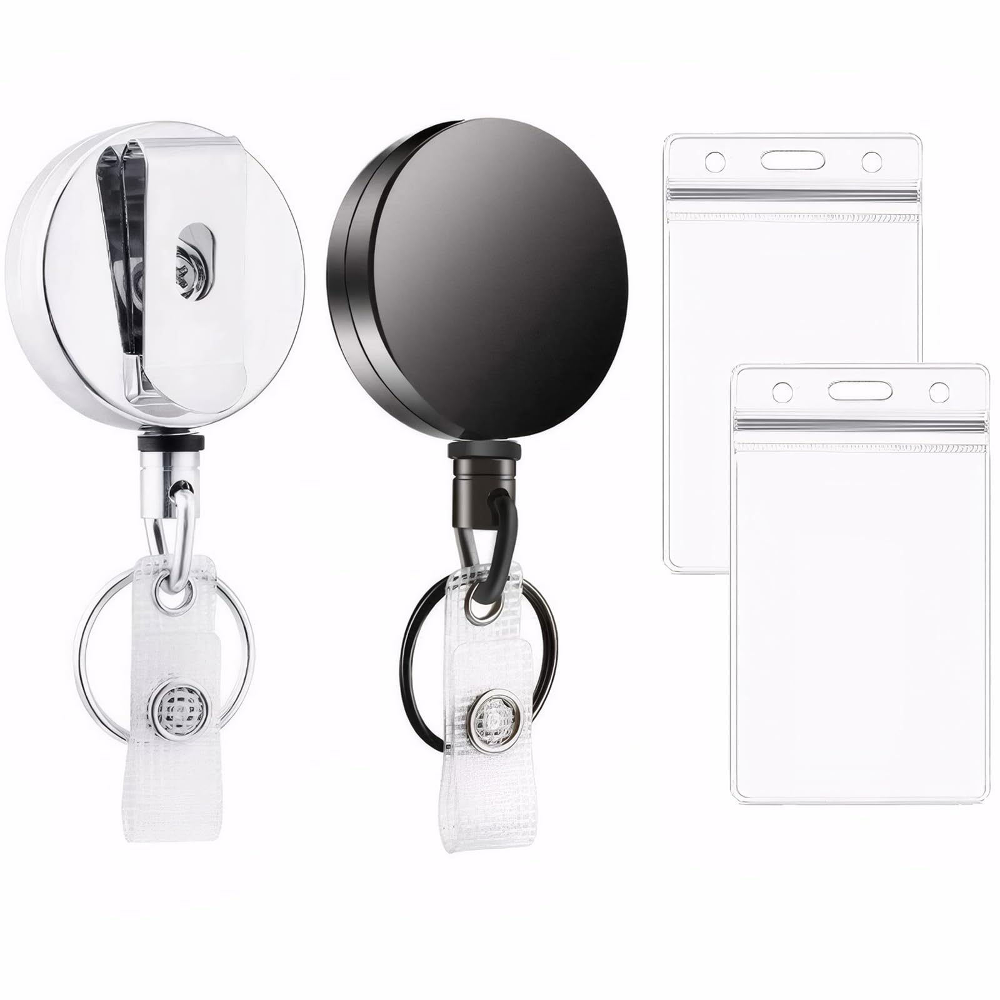

One reel clips to the top of the gantry extrusion, with its retractable cord running down to the toolhead's cable bundle — constant gentle tension keeps the bundle lifted and out of the way through the full range of X/Z travel, retracting and paying out as the toolhead moves instead of letting the slack drag.

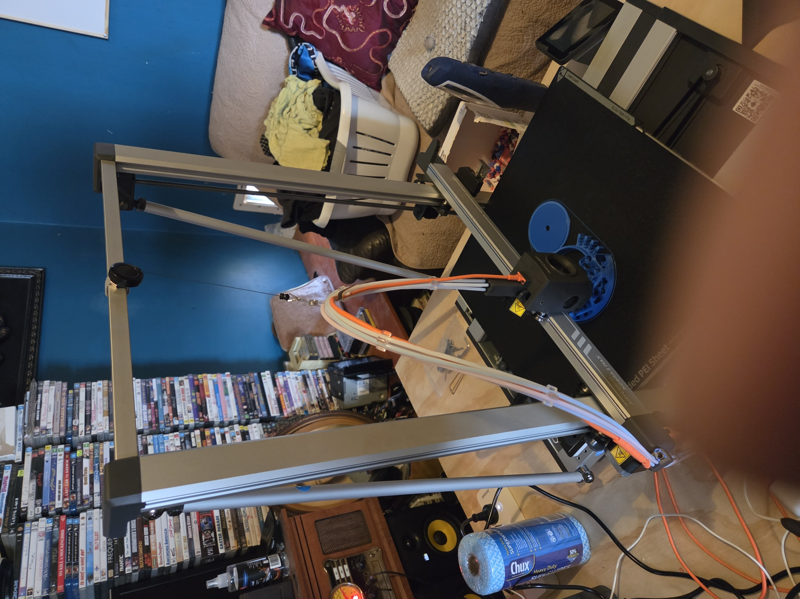

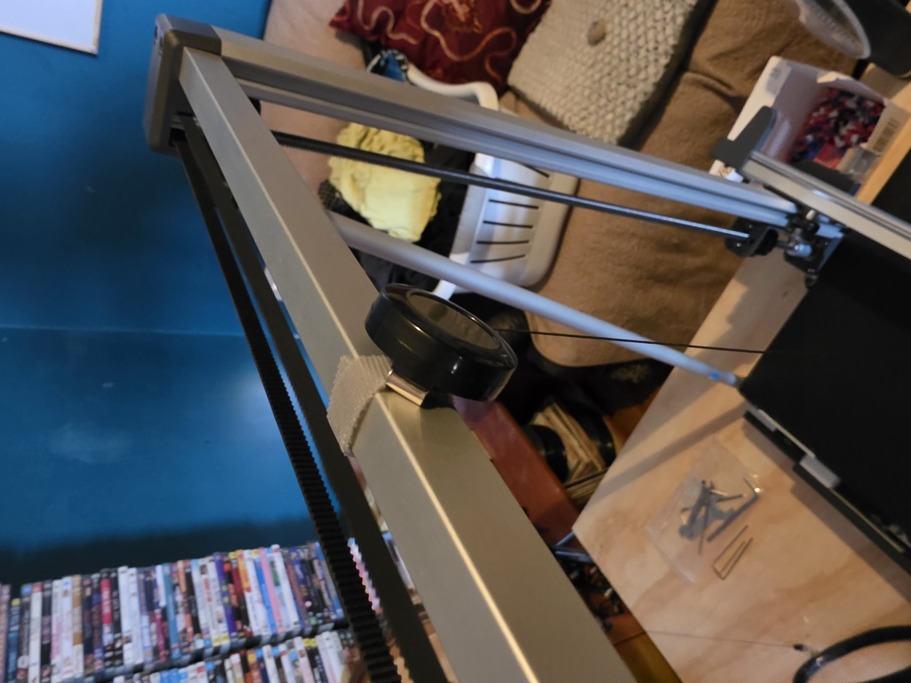

The second reel does the same job for the bed cables, mounted so its cord takes the weight off the cable run as the bed travels on the Y-axis, keeping it clear of the frame rail it would otherwise ride against.

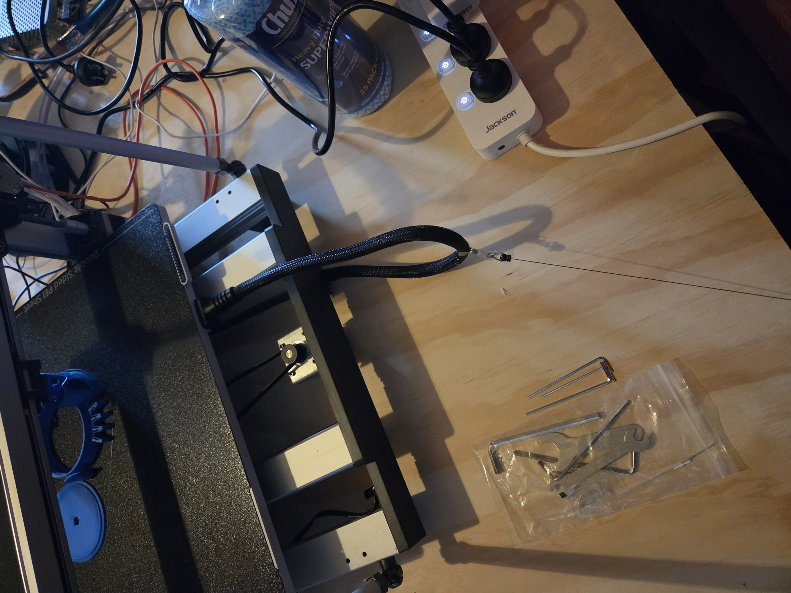

Nothing drilled, cut, or glued to the frame — both reels attach by their own clip, so the mod comes off clean if it's ever not wanted.

One detail visible in a couple of later photos but never actually written up here: each reel's clip needs something sturdy to pull against, so it's not tugging on real wiring connections every time it extends or retracts. A loop of solid wire, cable-tied to the wire tidy and wrapped around a washer, takes that load instead — a sacrificial strain-relief point rather than the actual connections.

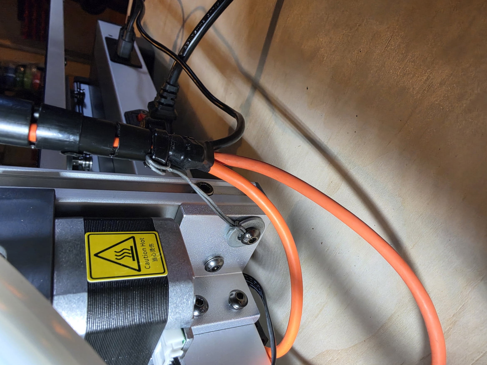

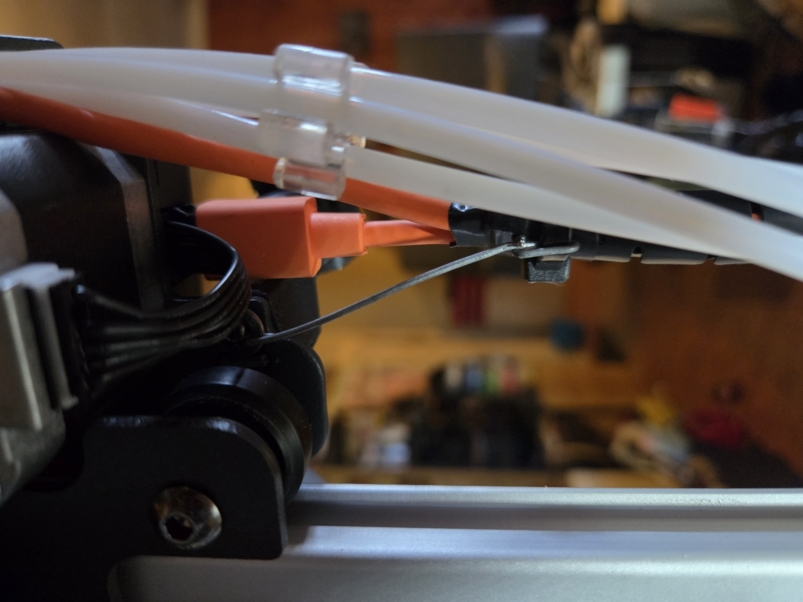

---

## Day 6 — Back to Stock, for Now

Reverting to stock solved the Rinkhals-specific bugs immediately — uploads worked normally again. But it traded away the one thing Rinkhals actually gave: any visibility into the printer at all when not standing in front of it. Anycubic's own path to that is a cloud account and their own app, both deliberately avoided here — not out of pure network-security habit, but because a cloud-connected printer means a print could get sent or resumed by someone other than you, or a fault could sit unnoticed on someone else's server instead of tripping a local alert. That's not an abstract worry on a machine whose nozzle runs at 300°C — a monitoring setup for that has to be something you actually trust, not a round trip through someone else's infrastructure. This is a printer on a home network with its own reverse proxy setup already in place; the fix needed to be local.

---

## Day 7 — No Monitoring on Stock → Building Kobra LAN Monitor

> **TL;DR** — Stock Anycubic firmware's only remote monitoring is its own phone app and cloud account — turn on LAN mode instead and you get nothing back, not even a local web page. So the local LAN protocol got reverse-engineered — with two existing community repos found and used along the way to cross-check the findings — and [Kobra LAN Monitor](https://github.com/A-to-PC/kobra-lan-monitor) was built: a real self-hosted dashboard, no cloud account required, released open-source.

### How the real protocol actually works

Anycubic's official apps (Slicer Next, the cloud app) talk to the printer over local MQTT — but they get there via a live handshake first, not a fixed set of credentials. That handshake, and most of the command set, got worked out directly first — about 80% of it before looking for anyone else's prior work at all. Two existing open-source repos got found and used from that point to cross-check and fill in the rest: [rvanderp3/kobra-connect](https://github.com/rvanderp3/kobra-connect) (the most complete public MQTT command reference found anywhere) and [SlimQuiggle/KobraCache](https://github.com/SlimQuiggle/KobraCache) (independently confirmed the file list/delete command shape, working live against a different Kobra model):

1. A plain HTTP call to the printer's own local API (port 18910) returns a token.
2. That token, combined with a timestamp and a nonce, produces a signed request for per-session credentials.
3. The response is AES-CBC encrypted; decrypting it (with key material derived from the original token) yields a broker address, a username/password, and a client certificate — all specific to that one printer, generated fresh every session.
4. From there it's a normal mutual-TLS MQTT connection, subscribing to the printer's own status topics and publishing commands (pause, resume, light on/off, temperature, fan, print-speed mode, filament/drying control, file listing) to its command topics.

> **Nothing hardcoded, and that mattered.** Every session performs its own live handshake against the printer's IP — there's no shared secret embedded anywhere in the code, in this project or the two referenced above. That distinction is what made open-sourcing the project reasonable at all: the protocol itself is already public knowledge across a small handful of independent community efforts (this one included), none of which embed Anycubic's shared fleet credentials. The one hard rule that stayed firm the whole way through: real shared/fleet-level secrets never go in a public commit, even though the protocol and the client code are fine to share.

### What actually shipped

Every feature below is confirmed against a real, running printer — not just "the code compiles" confirmation, actual "the commanded value changed the real machine" confirmation:

- Live status: state, progress, layer, ETA, nozzle/bed temps, fan speed, filament slots
- A genuine continuous camera stream (not polling), independent of Slicer Next needing to be open
- Pause / Resume / Emergency Stop
- Full file browser (local storage + USB): list, navigate, delete, thumbnail preview, upload, start a print
- ACE box: filament colours/types per slot, active-slot indicator, drying on/off
- Live controls: light on/off, nozzle/bed temperature, fan speed, print-speed mode mid-print

> **A camera that isn't the official one, works fine.** A generic USB webcam (Microsoft LifeCam HD-3000, 720p) works cleanly on completely stock firmware, no hacking required — despite Anycubic's own documentation implying you need their specific camera module. A higher-resolution camera (Razer Kiyo, 1080p) was also detected and streamed, but with a "doubled frame" artifact — reproduced identically in Anycubic's own Slicer Next too, so it's the printer's onboard video pipeline mishandling the higher resolution, not a fixable client-side bug. A 720p webcam is the safer bet until this gets more data points.

Getting here wasn't friction-free. A silent stale-connection bug (the dashboard would keep showing "Connected" with hours-old data after the socket had actually died, because nothing was probing it) only surfaced during a genuine multi-hour soak test — exactly the scenario the app exists for. Fixed with an explicit MQTT keepalive plus an application-level staleness watchdog, then re-confirmed with a full overnight soak test before calling it done.

---

## Day 11 — The Calibration Wizards Break

> **TL;DR** — Slicer Next's built-in temperature, retraction, and max-flow calibration wizards all silently print one flat value instead of a real sweep, with zero warning. The cause: repairing a mesh's "manifold errors" after setting up the test wipes the calibration settings, because repair rebuilds the object under a new internal ID. Don't repair — just set the range and slice.

This is the bug that ate a full night. Every calibration attempt — temperature tower, retraction tower, max-flow test — came out looking identical from top to bottom, no visible stepping, no error message anywhere to explain why.

### The trap

Slicer Next (an Anycubic-branded fork of OrcaSlicer — confirmed literally, some bundled files still carry their original OrcaSlicer names) supports per-height "Height Range Modifier" settings, letting one model print with different temperatures (or other parameters) at different heights. That's exactly how a calibration tower works: a temperature tower is really just a tall test print with a different nozzle temperature commanded every 10mm.

Importing a calibration STL commonly throws a "non-manifold" warning — an apparent invitation to click Repair. Doing that *after* the height-range settings were already configured is what silently breaks everything: repair regenerates the object under a new internal ID, and the height-range configuration stays bound to the old one. The print still runs. It just quietly falls back to a single flat value, because nothing is actually attached to what gets sliced anymore.

> **The actual working recipe.** No custom G-code, no rebuilding files by hand — the real fix is almost embarrassingly simple once you know it:
> 1. Open the calibration model (e.g. `temperature_tower.stl`).
> 2. Set the range/step directly (e.g. 210–240°C, 5° steps).
> 3. Slice.
> 4. In Preview, switch the colour-coding dropdown from **Line Type** to the parameter being tested (e.g. **Temperature**) and confirm multiple distinct colour bands — that's your proof it's actually varying.
> 5. Send and print directly.
>
> **Ignore the non-manifold error count on import.** One working run had 8 reported errors and printed perfectly. The only thing that actually matters is never clicking any repair action once the range is configured. Both `temperature_tower.stl` and `retraction_tower.stl` turned out to already be fully manifold anyway (confirmed via direct mesh analysis, zero non-manifold edges on either) — repair was never actually necessary for either one.

Confirmed against real hardware, not just theory: a temperature transition landed at exactly the predicted layer — 235°C commanded precisely at layer 51, the exact boundary a 10mm block at 0.2mm layer height should produce. The math and the workflow both checked out precisely, not approximately.

### The max-flow test's extra wrinkle

The max-volumetric-flow test uses a continuous vase/spiral toolpath — Z climbs on almost every single line, not in discrete layers. A naive check of the periodic layer-comment markers in the gcode can read as "flat" even when the real per-line feed rate is genuinely ramping, because those markers don't fire on every line the way they do in a normal layered print. The only reliable check is the actual per-line Z/F values in the raw gcode — a genuinely-orphaned flat result and a real, working sweep can look deceptively similar from the printed object alone.

### Building an alternative, in parallel

Frustration with fighting Slicer Next's format led to starting a completely independent calibration tool from scratch — a small Windows app that generates calibration test G-code directly as simple parametric geometry, no real slicing engine involved at all, since calibration prints are just repeating shapes. The temperature-tower module got built and worked; retraction, flow, and max-flow modules were scaffolded but not finished, because the real Slicer Next fix was found in parallel and made the workaround less urgent. It ended up retired later (Day 14) once the real fix made it redundant — sometimes the thing you build out of frustration isn't the thing you end up needing.

### Two real lockups, and what caused them

Trying OrcaSlicer directly (rather than Anycubic's Slicer Next) as an alternative path seemed reasonable — until it hard-locked the printer, twice, both requiring a full power cycle to recover. Neither attempt got a parse error or any visible rejection; the printer simply stopped responding to everything, including basic network reachability.

> **The real cause: a command flood, not a bad file.** An offline command-frequency diff between a known-good Slicer Next export and an OrcaSlicer export of the exact same model found it: OrcaSlicer's Klipper G-code backend emits the native macro `SET_VELOCITY_LIMIT` on every single print-feature change — walls, infill, travel — **8,226 times** in one ~350-layer print. Slicer Next's real output calls the equivalent macro **exactly once**, using the Marlin-style `M204 S<value>` instead for all per-feature acceleration control. The printer's firmware almost certainly can't handle that command at that call volume — a full lockup, not a rejected/invalid command, points at a buffer or queue bug rather than a parser one.
>
> A second identical-model comparison reproduced the exact same pattern, ruling out "unusual geometry" as the explanation. The command itself isn't forbidden or unrecognized either — it's a genuine, intentionally-exposed controller method in the firmware's own API. It's specifically the volume of rapid-fire calls that nobody designed the firmware to handle.

The practical rule that came out of this: never send an OrcaSlicer-generated file — raw G-code or a repackaged `.3mf` — to this printer without translating its dialect first. A working translator was built and verified offline (rewriting `SET_VELOCITY_LIMIT` calls to `M204`, `SET_PRESSURE_ADVANCE` to `M900 K`, inserting the acceleration/jerk-limit commands OrcaSlicer never emits at all) — a translated file was tested live afterward and, critically, did not lock up the printer, unlike either untranslated attempt.

---

## Day 11-12 — Firmware Archaeology

> **TL;DR** — Anycubic's official `.swu` firmware update files are encrypted with a publicly-known password (documented by the Rinkhals project) — decrypting one is completely offline, zero-risk, and answers questions no official documentation covers at all: real safety temperature limits, the real upload pipeline, and the actual mechanism Rinkhals itself uses to install.

Two things made this worth doing directly rather than guessing: the ongoing upload-path mystery (files were getting accepted by the printer but never actually appearing in its own file list), and general curiosity about what the wizard bug and the OrcaSlicer lockup actually shared underneath.

### Getting inside, safely

A `.swu` file is a plain ZIP containing one more ZIP (`update_swu/setup.tar.gz`) that's ZipCrypto-encrypted using a password that's already public knowledge in the Rinkhals community. Decrypting it needs nothing more than Python's own built-in `zipfile` module and that password — no custom tooling, and critically, nothing that touches the actual printer. This is purely reading a file Anycubic already published for public download.

> **What the firmware actually confirmed.** The `.swu` for the version running at the time only contains the "app" tier — the touchscreen UI, camera service, and local API server, about 83 files total, all Go-language ARM binaries. No Klipper/MCU source in this package; that layer (where `SET_VELOCITY_LIMIT`, the mesh-leveling macros, etc. actually live) is separate and updated less often. What was in this package still settled a lot:
> - Real safe temperature range, straight from the config: **185–300°C** for the nozzle — the stock calibration reference tower's full 170–350°C range genuinely exceeds the firmware's own configured safe bound at both ends.
> - The real gcode storage path (`/useremain/app/gk/gcodes/`) and the local API's real port (18086, loopback — the LAN-facing port the dashboard actually uses is a separate gateway in front of it).
> - Port 80 hosts a real, live JSON API — but with no REST-style URL paths anywhere in the binary's strings, pointing at a Go `net/rpc`-style single-endpoint dispatcher (method name inside the request body) rather than per-action routes.

### Solving the upload mystery, from the actual source

Go binaries keep readable function and string names unless deliberately stripped — which these weren't. A short script scanning for runs of printable characters turned three compiled binaries into a surprisingly complete picture of the real upload/print pipeline, replacing everything that had been inference or guesswork up to that point:

- The real upload endpoint takes no destination path parameter at all — the `root=local`/`path=` fields tried earlier were harmless guesses that Go's HTTP server just silently ignored, not the actual fix.
- An uploaded package gets extracted to a staging directory, run through a "3MF precheck" (which can fail on insufficient space), then searched for a matching `plate_*.gcode` file inside — preferring `Metadata/plate_1.gcode` specifically, falling back if that exact name isn't found.
- A separate "convert legacy 3mf" step exists too, with its own distinct failure mode — meaning a hand-rebuilt file, even one that's byte-verified correct, can still get classified as "legacy" and fail at a completely different stage than expected.
- "Printer is busy, cannot upload while printing" is a real, distinct rejection — meaning a stuck busy-state left over from an earlier crashed attempt could easily explain later failures that look format-related but aren't.

> **The one line that decodes the update mechanism entirely.** The whole update-validation chain, read straight from the real update script, is one line: unzip the package with the known password into the right directory. No signature check, no certificate, no checksum beyond whatever the unzip step itself does. Anything with the correct password and file layout gets executed as a firmware update. The same script also runs `killall sshd` and deletes the SSH binaries on every single update — the underlying OS fully supports SSH, Anycubic just strips it out every time, almost certainly specifically to fight back against exactly this kind of community modding.
>
> Separately, the USB-drive update trigger folder name is base64-obscured in the script (trivial to decode): drop an `update.swu` into a folder literally named `help_sos_` at the root of a USB drive, insert it, and the firmware detects and runs it automatically — no menu interaction at all. This is almost certainly the exact mechanism Rinkhals itself uses to install.

None of this turned into a shipped addon — the actual plan (a self-hosted web UI running directly on the printer's own storage, reverse-proxied the same way this printer's other self-hosted services already are, replacing the separate always-on PC that Kobra LAN Monitor currently needs) was scoped out, prototyped briefly, and then dropped once the LAN Monitor + Advanced-tab approach covered the same ground without needing to touch the printer's own storage at all. The most promising lead for it, kept here in case it's ever worth revisiting from scratch: a Unix domain socket the firmware's own API config points at, which is very likely Klippy's own standard socket — the same one real Moonraker connects to on any normal Klipper install.

---

## Day 12 — Clean Prints, For Real

> **TL;DR** — Full calibration confirmed against real hardware, Kobra LAN Monitor packaged into a proper installer and released, and a second, completely separate print-quality mystery (blobby embossed text) traced to a slicer wall-order setting, not the calibration at all.

Every calibration value — temperature, flow, pressure advance, retraction, max volumetric speed, all three speed modes — got confirmed against real prints today. The full table lives in its own reference section: **[My Confirmed Calibration](#reference-my-confirmed-calibration)**.

> **Settings can silently revert on unrelated edits.** Changing body layer height from 0.20mm to 0.12mm — the *only* field touched — silently reset retraction back to the old 0.8mm default, with no warning at all. Same underlying class of bug as the mesh-repair issue from Day 11, just a different trigger. After any profile edit, including a plain layer-height change, re-open the retraction and filament settings and confirm temperature, pressure advance, flow, and retraction all still match the reference table before trusting a print.

> **A diagnostic trap: over-extrusion that isn't.** What first looked like real over-extrusion at 0.12mm layer height turned out to actually be First Layer Height silently reverting to match the new 0.12mm body height instead of staying at the separately-set 0.20mm — a third casualty of the same layer-height-change bug that already hit retraction. A too-thin first layer drags and scrapes rather than laying down cleanly, and that dragging visually mimics real over-extrusion closely enough to send you chasing completely the wrong setting. **Before touching flow rate after any layer-height change, confirm First Layer Height first** — it should generally stay around 0.2mm regardless of how thin the body layers get.

Kobra LAN Monitor also got packaged into a real Inno Setup installer today and released open-source.

### A second mystery: blobby text, wrong lever

Well after the main calibration was confirmed clean, a completely separate print — a set of small filament-spool ID labels, and later a multi-part organiser with embossed diameter labels — came out with a blob concentrated at roughly one spot on every single piece, plus a matching split in the surrounding skirt outline.

Retraction distance was the obvious first suspect (many small islands means many more retract/prime cycles than the calibration tower ever tested) — bumping it from the confirmed 0.2mm to 0.5mm as a "meet in the middle" test changed nothing. Seam position was already set to Random. Neither was the actual lever.

> **The real cause, found by reading the actual profile file.** Rather than keep guessing through the UI, reading the process profile's saved JSON directly (Slicer Next stores per-profile overrides in plain, readable files) surfaced it immediately: `wall_sequence` was set to **"Inner/Outer/Inner"** instead of the standard two-step order. That sequence sandwiches the visible outer wall between two inner passes — meaning every single closed loop in the model, including each tiny letter-stroke in embossed text, gets an extra start/stop transition compared to the normal order. More transitions per shape means more chances for a seam/wipe artifact to show up, concentrated right at each loop's restart point — which is exactly the pattern in the photos.
>
> Alongside it, `filament_max_volumetric_speed` was still sitting at 200mm³/s — a value deliberately raised during the max-flow calibration test itself (so the sweep wasn't artificially capped by the stock 13mm³/s default), but never brought back down to a real number afterward. Left at 200, it effectively disables the slicer's own protective flow-rate limiter entirely. Corrected to 20mm³/s — comfortably above what the current wall speeds actually need, but a real number again instead of "off."

> **One more, purely physical lesson.** A separate thin-ring-shaped part failed for a completely different, much simpler reason: not enough bed contact area for reliable first-layer adhesion. The fix wasn't a slicer setting at all — a proper bed clean (soap, then isopropyl alcohol, then a fresh glue-stick layer) solved it outright. Worth remembering: not every print-quality problem is a calibration problem. Sometimes the plate's just dirty.

> **Also worth knowing before chasing a settings problem.** If a defect is confined to a specific part of the object or a specific gcode feature type rather than spread evenly throughout, general settings that apply to every layer (wall order, seam, retraction) are the wrong first place to look — check what's actually printing at that exact point instead. Some embossed-label text later turned out to be entirely first-layer content (printed directly on the bed, not distributed through the print), which reframes the whole troubleshooting direction: first-layer squish and bed-texture transfer become the live suspects, not anything that governs the rest of the print.

---

## Day 13 — Cloud Bypassed a Second Time, and a Virtual Printer Gets Built

> **TL;DR** — Firmware-update checking inside Kobra LAN Monitor turned out to be cloud-gated too, so a second genuinely cloud-free path got built. Along the way, the real firmware binary itself got running as a genuine virtual printer, so future features can be tried safely without touching real hardware mid-print.

### A second cloud workaround: firmware updates, and a proper Advanced tab

The one feature stock firmware still gates behind a cloud connection turned out to be checking for its own updates. Digging into the printer's real update protocol (the same binary-string-reading approach from Day 11-12, applied to this printer's own MQTT service) found there's no command to actively ask "is there an update" at all — the printer just reports its current version automatically whenever its own cloud connection comes up, and Anycubic's server replies on a separate topic if it feels like it. In LAN mode, with no cloud connection, there's simply nothing to overhear.

> **A real attempt at beating the cloud outright, before settling for working around it.** Before landing on the manifest approach below, a live network packet capture (LAN mode briefly switched off between prints, purely to observe) confirmed the printer's cloud connection genuinely works — a real TLS handshake to Anycubic's own MQTT broker, followed automatically by a real multi-kilobyte fetch from an Anycubic-owned cloud storage bucket, without a single "check now" action anywhere on the touchscreen. But that connection uses TLS 1.3, which encrypts the entire certificate exchange on both ends — there's genuinely nothing left to extract from the wire that way, no matter how much traffic gets captured. Confirming that dead end for certain, rather than assuming it, is what made the local-comparison approach the right call rather than a fallback.

> **The fix was the same idea as the dashboard itself: don't need the cloud account at all.** The printer already reports its own current version locally, over the LAN protocol Kobra LAN Monitor already speaks. Comparing that against a small, self-maintained list of real published firmware versions — sourced from [Rinkhals' own community firmware mirror](https://github.com/jbatonnet/Rinkhals.Firmwares), since Anycubic doesn't publish a direct-download page for this printer at all — gives a real, working update check with no cloud account, no device pairing, nothing.

Everything that isn't core, at-a-glance monitoring — checking for updates, disabling the steppers, reading the raw toolhead position, feeding/unwinding ACE Pro filament manually, browsing time-lapse video — moved to a second Advanced tab today, so the main dashboard stays exactly what it was built to be: something to glance at, not read. Not every command on that page had been fired at a real printer yet either, so each one got labelled honestly with how sure it actually was: confirmed working, confirmed to exist in the firmware but untested, or an educated guess with no confirmation at all.

> **Exporting a video turned out to be a dead end worth explaining, not just a failed guess.** The Advanced tab originally offered an "Export" button next to each video, guessing at the real network command for it. It never worked — and reading the touchscreen's own code (rather than guessing further) explains exactly why: on the real device, Print → Videos → select a video → Export just calls a plain native file-copy function, directly, from internal storage to a USB drive plugged into the printer. No MQTT, no HTTP, no network step of any kind — confirmed both by testing it live (a USB stick, no prompt, silently does nothing without one) and in the decompiled code itself. It doesn't need a network command because the code doing the copying already runs on the printer itself, with direct access to both its own storage and the USB port. That's not something any remote app — this dashboard included — could ever trigger the same way, so the guess-tier Export button was removed rather than left in place pointing at something that can never work.

### Building a virtual printer, so nothing has to risk the real one

Three separate questions all pointed at the same next step:

1. **What are the printer's real commands, exactly as the firmware itself defines them** — not inferred from someone else's partial write-up, not guessed by naming pattern, but read straight from the actual server software the printer runs.
2. **How does the update system's cloud authentication actually work** — what a device genuinely needs (credentials, certificates, identity) to be accepted as "this specific printer" by Anycubic's own servers.
3. **Why does the update-check system behave the way it does at all** — why LAN mode leaves it with nothing to report, and whether that's a gap in this dashboard or a real limit of the firmware itself.

All three needed to poke directly at how the printer's own server software actually behaves under real conditions — and that's not something to do carelessly on a machine whose nozzle runs at 300°C, especially not mid-print. So the extracted firmware itself became the target: could the real server binary the physical printer actually runs be booted up as a virtual printer instead, safe to prod as hard as needed?

It turned out yes, further than expected. Running that real ARM binary under an emulator, backed by a small stand-in for the Klipper layer it expects to talk to, got surprisingly far:

> **A genuinely bootable virtual K3M, not just a binary that runs.** Once a handful of startup requirements were worked out one at a time — a device-identity file it insists isn't blank, a folder of certificate files in the exact format it expects, a hidden mode-flag file that turned out to gate the entire local network stack from starting at all — the emulator's local MQTT broker came up for real, genuine printer-shaped traffic flowing across it, alongside the exact same local network-discovery response a real printer gives out. Any app on the same network, including Kobra LAN Monitor itself, can be pointed at the emulator's address instead of the real printer's and go through the identical connect flow, none the wiser.

That answered all three questions directly, from the source, rather than by inference:

- **Real commands, ground truth.** With the actual firmware running and readable, every command Kobra LAN Monitor's Advanced tab uses (steppers, toolhead position, ACE Pro filament control, time-lapse video) could be confirmed as a genuine, literal command the firmware defines — not a guess dressed up to look confident.
- **Cloud auth, confirmed.** The update-check cloud connection turned out to need its own, completely separate device identity — its own certificate and per-device credentials, tied to Anycubic's own account/activation system — genuinely different from the plain local network credential this dashboard already uses for everything else. One doesn't substitute for the other, settled directly rather than assumed. The mechanism itself is a real, working scheme, not a plain shared secret: the cloud MQTT password is the device's own key value, RSA-encrypted using the public key pulled straight out of the connection's own certificate-authority file — meaning that file isn't just there to validate trust, it's an active ingredient in building the password itself.
- **The update system's real reasoning, confirmed.** There is no "check now" command anywhere in the firmware at all. It reports its own version automatically the moment its cloud connection comes up, and Anycubic's server answers on a separate channel if it feels like it — which is exactly why LAN mode (no cloud connection at all) leaves nothing to report, and exactly why the cloud-free version check above had to be built the way it was rather than just "fixing" a missing button.

One genuine investigative bonus along the way: the emulator's own debug log turned out to be freely readable — a level of visibility into exactly what the firmware is thinking that was never available even with full owner access to the real printer's own export/diagnostic tools.

Not everything came along for the ride. The touchscreen interface and the camera service both depend on proprietary vendor graphics/media libraries that only exist on a real device's own storage, never published anywhere — including by the Rinkhals project itself, which patches the real UI binary in place rather than reimplementing it, for the same reason. That's a known, finite list now, not a vague gap.

What this actually buys going forward: a safe place to try new ideas against real firmware behaviour first, with zero risk to a printer that might be mid-print at the time.

> **Tightened `filament_max_volumetric_speed` to 18mm³/s.** Once back to normal, non-calibration printing, the 20mm³/s number set on Day 12 got pulled down further to 18mm³/s — closer to what everyday prints actually ask of it, rather than leaving extra headroom in "just in case."

---

## Day 14 — The Virtual Printer Gets Its Real Identity, and a Real Answer on Usage Tracking

Multi-printer support got added to Kobra LAN Monitor today. The old calibration-generator tool from Day 11 and its planned on-printer addon from Day 11-12 were both retired too, superseded by the real fixes found along the way — neither was ever published as its own repo.

> **The real device identity, tested for real — one piece confirmed working, one still missing.** The real account credentials (pulled straight off the printer using the same USB export feature already covered on Day 11-12 — no SSH needed for this part) dropped into the emulator and changed the result immediately: the connection attempt went from being rejected at the security-handshake stage to being rejected afterward, by name, as "not authorized" — a completely different, later-stage failure. That's real forward progress, not a guess: the printer's own account identity is now confirmed correct and genuinely being used. What's left is the one piece that can't be reached the same easy way — the real per-device certificate itself, which never gets written anywhere a USB export can see. Recovering that needs a brief, careful visit from Rinkhals on the actual physical printer, purely to copy the files off before reverting straight back to stock.

> **Two real hypotheses tested and ruled out along the way, not just one lucky guess.** Before the certificate turned out to be the actual answer, two other real possibilities got checked directly rather than assumed. First: does the real printer's own hardware serial (the actual SoC ID, pulled from the printer's own boot log) matter to the cloud connection? Compared directly against the emulator — but the real, recovered `device.ini` has that field blank too, and the real printer is independently confirmed (via the earlier packet capture) to connect fine with it blank, ruling it out by direct comparison rather than a guess. Second, more hands-on: actually faking the emulator's own hardware-info file to report the real printer's exact board and serial number, live-tested against the cloud connection. Same "not authorized" result, completely unchanged — a genuinely useful negative, confirming the firmware doesn't even read that value at connect time at all. Both dead ends narrowed it down to the one thing left that was still fake: the certificate itself.

> **Later the same day: done — the real cloud connection genuinely works.** The brief Rinkhals visit happened: the small, one-time-use install variant (self-removing on the next power cycle, no manual revert needed), SSH in, three files copied off (it turned out to be three, not four — no separate key file exists on the real device, just a certificate, a private key, and the certificate authority's own cert), then straight back to stock. Dropped into the emulator in place of the placeholder: the connection succeeded outright. Not "further along" — actually connected, with the real server sending back real data (this printer's own actual time-lapse filenames, a genuine firmware-update response with real changelog text). The whole cloud-auth question that opened Day 13 is genuinely closed. Worth being just as plain about the limits: this only works because it's this one printer's own real, personal credentials — it was never going to become a feature in any of the tools in this log, and it stays exactly what it's been from the start, a way to understand and verify the protocol, not something to ship.

Getting the cert meant briefly flashing Rinkhals again, and that side trip turned up three more real findings, none planned.

> **Disabling Rinkhals, and even a full factory restore, resets settings and behaviour — not the installed files themselves.** After pulling the cert, the plan was to use Rinkhals' own in-menu option to switch back to stock rather than wait out the self-removal. Afterward, the camera stopped working and the touchscreen threw a toolhead/head-cable communication error — despite that cable being physically secured by two screws at each end, not something that works loose on its own. A full factory restore, putting the printer back to exactly how it behaved before Rinkhals ever went on, cleared the problem completely. The Rinkhals folder itself is still sitting on storage even after that restore, though — not a bug, just how this firmware's storage actually works: disabling something, or resetting settings, stops it running without erasing it. Worth knowing plainly if it matters to you: "back to stock" fixes the behaviour, not the storage footprint — actually deleting the files would need its own separate, deliberate step.

> **The factory restore raised a second, more interesting question, and it turned into a real, testable finding: does the printer's lifetime print-count stat survive a reset, or can it just be wiped?** Directly relevant to anyone buying one second-hand — a usage "odometer" that resets on demand isn't worth much. No Anycubic account was ever created for this printer, in the app or on the machine, at any point — but the app *was* briefly connected in default/cloud mode right at the very start of ownership, before LAN mode was even discovered, and a handful of short test prints happened and got personally watched ticking up in the app at the time. After the factory restore: **3h15m, 77.1g, 7 prints** — matching that exact early window almost perfectly (seven short prints averaging under half an hour each), and nowhere close to the real usage since: a print that failed four hours into a six-hour job, plus two more 3-hour-plus prints the day before, none of which survived the reset at all. That settles it: the tracking is real and does survive a local reset, but it's tied to the printer's own cloud connection, not to a signed-in account (there wasn't one) and not to genuine tamper-proof local storage either. The moment LAN mode is on, usage becomes invisible to it — for better (nothing about how this printer actually gets used is reported anywhere) and for worse in more than one way: a second-hand buyer checking this number on a LAN-mode machine would have no real idea how much it's actually been used, and the same applies the other direction too — if a LAN-mode owner ever logs a fault with Anycubic, their own side shows a machine with almost no hours on it, whatever the real total actually is. Diagnostics that would normally weigh against usage have nothing real to go on either way. Probably not deliberate — this reads more like a basic usage-stat convenience for Anycubic's own app than a real anti-tamper design — but the gap is genuine either way, whatever the intent behind it.

> **A genuine, independent confirmation, found by reading Rinkhals' own optional "Firmware Collector" feature in full.** Enabled out of curiosity during the same visit — a real, privacy-respecting opt-in tool that checks Anycubic's servers for newer firmware and reports back only version metadata, confirmed by actually reading its code rather than trusting its own docstring's privacy claim. What made it worth mentioning here: its own update-check logic independently re-derives the exact same cloud authentication scheme — the same certificate-encrypted password mechanism from earlier — that this whole investigation had already reverse-engineered from scratch. Written by someone else entirely, for a different purpose, matching exactly. Real, independent confirmation the reverse-engineering was right, not just internally consistent with itself.

---

## Day 15 — RFID Filament Tags, and the Advanced Tab's False Failures

> **TL;DR** — The ACE Pro can read a filament tag per slot and auto-fill material and colour instead of typing it in by hand every load, but only if the tag holds the right structured data. Also: four Advanced-tab commands had been failing with a misleading "no connection" message despite a genuinely live session — traced and fixed.

### Making the ACE Pro actually automatic

Every slot on the ACE Pro can already be set manually — material, colour, done by hand each time a spool goes in. RFID tags on the spool itself are what let the ACE Pro skip that step entirely: tap the spool in, and it already knows.

A generic phone NFC app (any of the several "NFC Tag Reader/Writer" apps on the Play Store) can write standard NDEF records — Text, URL, and similar. That's the wrong tool here: the ACE Pro doesn't read a literal text string off the tag, it reads structured data in specific memory blocks, the same general approach Bambu's AMS-style RFID tags use. Writing "PLA" and "black" as plain text and reading it back afterward found neither word anywhere in the tag — not because the write failed, but because that's simply not the format the printer (or any purpose-built filament app) actually uses.

> **A real, permanent mistake, not just a wasted attempt.** The first tag written this way came out locked — read-only, un-writable, for good. NTAG-family chips support a genuine one-way hardware lock bit, and it's easy for a generic app (or an option left switched on inside one) to set it during a write without making that obvious at the time. That tag was done. The only fix was peeling it off and sticking a fresh one on.

A dedicated filament-RFID Android app — built specifically for this kind of tag, not a generic NFC utility — replaced the guesswork. Writing "PLA, black" through it and reading the result back (still in a generic NFC app, for comparison) again showed no literal "PLA" or "black" text in the dump, which is expected: the purpose-built app encodes material as a numeric code and colour as an RGB value into the tag's memory blocks, not as readable text. The real test isn't whether a human can read the dump — it's whether the printer can.

It could:

- The tagged spool went straight into the ACE Pro. The printer's own screen showed **black** immediately, no manual entry.
- Syncing Slicer Next against the ACE Pro pulled the same colour through automatically.

> **The real proof: a manual-override test.** To rule out a coincidence or a stale cached value, the slot's colour was manually changed to green in software, the tagged spool was removed, then the exact same spool went straight back into the exact same slot. The printer corrected itself back to black on its own, with zero manual input. That's the actual thing this was for — the tag drives the printer's own record every time the spool is reinserted, not just on a first read.

The ACE Pro's tag format is compatible with a mainstream, purpose-built Android filament-tag app — not locked to Anycubic's own pre-programmed tags, and not something that needed reverse-engineering from scratch the way the LAN protocol did on Day 7. Two things not yet confirmed: which of the ACE Pro's two internal RFID reader antennas actually serves which of the four slots (a real per-slot mapping test, not done yet), and whether other materials/colours beyond this one write hold up the same way. Both are straightforward follow-up tests, not open questions about whether the approach works at all.

### Advanced tab's false failures, finally explained

Disable steppers, toolhead position, feed filament, and unwind filament all failed the same way — a 10-second hang, then "no live connection to printer" — even while other features on the exact same session (browsing videos, the version check) kept working the whole time. Capturing the app's own log at the moment of a real click found the actual cause: the printer genuinely answers an `axis` query with a real report, it just never echoes back the specific request's own ID the way file and video queries do, so the app's strict match against that ID was waiting for something that was never coming. Fixed by matching the reply by type instead of ID as a fallback — and toolhead position turned out to have been working all along underneath the bug: it now returns real, live X/Y/Z coordinates.

The other three didn't get the same happy ending. Disable steppers and feed/unwind filament all send cleanly now, no more false failure — but a direct physical check (watching the gantry, watching the ACE Pro) confirmed none of them actually do anything yet, even after correcting a guessed parameter (the ACE Pro's box ID) from a hardcoded 0 to its own real reported value. These are genuine, literal command names read straight out of the firmware, not invented — the string being real just isn't proof the guessed payload, precondition, or even the channel (MQTT vs. the still-undeciphered port-80 API) is right. Rather than hide that or quietly delete the buttons, the Advanced tab got split into two honest sections: **Confirmed Working** and **Unconfirmed — Real Commands, Kept as Breadcrumbs** — a real command name is still a real lead for whoever finds the rest, even if "whoever" ends up being a live packet capture of Slicer Next's own traffic doing the same three things, the same method that already cracked pause/resume/file-list/drying control. Released as v1.0.4.

---

## Day 16 — Tearing Down a Spare Toolhead for Real Fan Answers

> **TL;DR** — A hunch that the toolhead's existing cooling duct might already be good enough, and a better fan alone could improve print cooling, turned into a real teardown of a spare toolhead rather than guessing from marketing specs. Found the real fan (Anycubic's own product page has the wrong dimension for it), a genuine better-on-every-axis replacement, and worked out a real, reasoned case for partially blocking the cooling duct — using an actual diagram of where each opening lines up with the nozzle, not a guess.

Print-quality chasing (Day 12's blobby-text mystery, and a real one this session too — a wall-to-floor gap fixed by raising infill/wall overlap from 10% to 25%) kept circling back to the same question: is the toolhead's cooling actually good, or is the duct itself the bottleneck? A close look at the physical design suggested the duct geometry into the hotend's magnet cover was already reasonable — which would mean a better fan, not a new duct, was the real lever worth pulling.

### Opening a spare, not the printer that's running

All of this happened on a boxed spare toolhead, never the one actually printing — zero risk to anything mid-job.

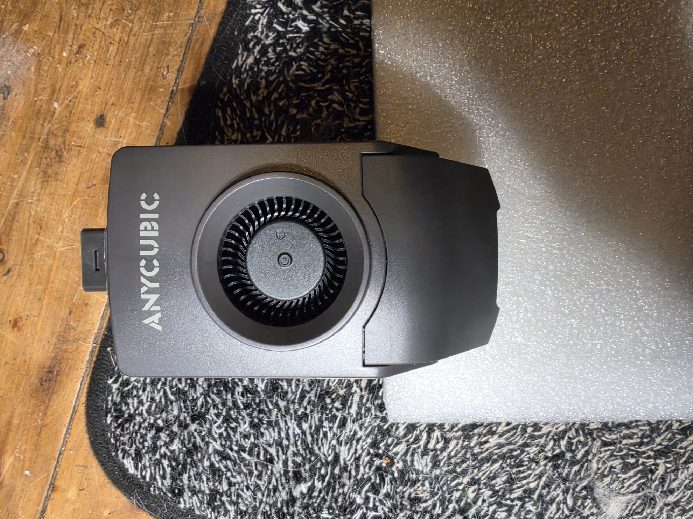

Getting inside corrected a few assumptions immediately. There are genuinely **two separate fans**, not one:

- A **50mm fan on the front**, ducted straight down to nozzle-tip height — a textbook part-cooling design, confirmed both by the physical duct path and by the firmware itself (Klipper's `[fan]` object on `nozzle_mcu:PB6` in the real `printer.cfg`, extracted on Day 11-12).
- A **20mm fan on the side**, blowing directly over the silicone sock covering the heater block. That's not part cooling at all — it's heat-creep prevention, keeping the heatbreak/heatsink area cool enough that filament doesn't soften too high up and jam. Matches Klipper's `[heater_fan extruder_fan]` object on a separate pin. Upgrading this one would help long-term reliability, not print quality.

Both fans turned out to be genuinely simple 2-wire (power only) connections, not 4-wire PWM — the PWM control the firmware clearly does exists, it just happens on the toolhead's own local board (labelled `PrintHead_NF030_V1.7`) via its own switching transistor on the power line, not a separate signal wire to the fan. That's a useful, concrete finding on its own: **any genuine 24V 2-wire DC fan is electrically compatible** as a replacement here, not just something marketed as "4-wire PWM."

### The real fan, read off its own label

Anycubic's own product page for this part (SKU S010229) states 50×50×**20mm**. Reading the label directly off the actual physical fan — then confirming with calipers after removing the magnet cover — settled it: the real part is 50×50×**15mm**. Anycubic's own published spec is simply wrong for this part.

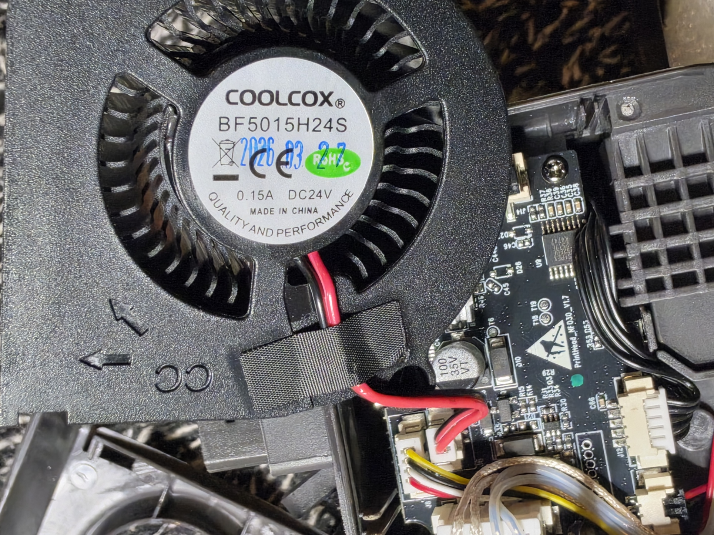

The real part: **CoolCox BF5015H24S**, 24V DC, 0.15A. A real, searchable manufacturer part number beats a vague marketing spec every time — from here, CoolCox's own official datasheet for the fan's 20mm sibling (same "H" performance tier, same 0.15A current) gave a genuine number to work from: 5,500 RPM, 4.90 CFM, 38.0 dBA, sleeve bearing. The exact 15mm/24V datasheet itself couldn't be tracked down despite real effort — CoolCox's own site 404'd repeatedly, a major datasheet aggregator blocked the request, and one third-party reseller listing showing 0.06A directly conflicted with the 0.15A read straight off the real label (the label wins). Interpolating from two genuinely confirmed sibling datasheets puts the real stock fan at roughly **5,000-5,500 RPM, 3.0-3.5 CFM, 34-38 dBA** — an estimate, honestly labelled as one, not a manufacturer-confirmed number.

### A real, better-on-every-axis replacement

| | Stock (CoolCox BF5015H24S, estimated) | GDSTIME 5015 24V Dual-Ball |
|---|---|---|
| RPM | ~5,000-5,500 | **6,000** |
| Airflow | ~3.0-3.5 CFM | **5.36 CFM** |
| Noise | ~34-38 dBA | 38.7 dBA |
| Current | 0.15A | **0.1A** |
| Bearing | Sleeve | **Dual ball** |
| Size | 50×50×15mm | 50×50×15mm (exact match) |
| Connector | 2-pin | 2-pin |

More airflow, more RPM headroom, a genuinely better bearing type for longevity, and a *lower* current draw despite the higher output — actually more efficient, not just more powerful, for around $8. Same physical footprint too, so it should be close to a drop-in — the one snag found so far is the new fan's outlet spout is a different shape to the stock duct opening, planned fix is a small 3D-printed adapter piece, measured directly off the real stock duct.

### A reasoned case for narrowing the duct

Separately, a look at the duct's own shroud around the nozzle raised a real question: it has 5 rectangular vent slots (3 above the nozzle, 2 below), all fed from the same fan and chamber.

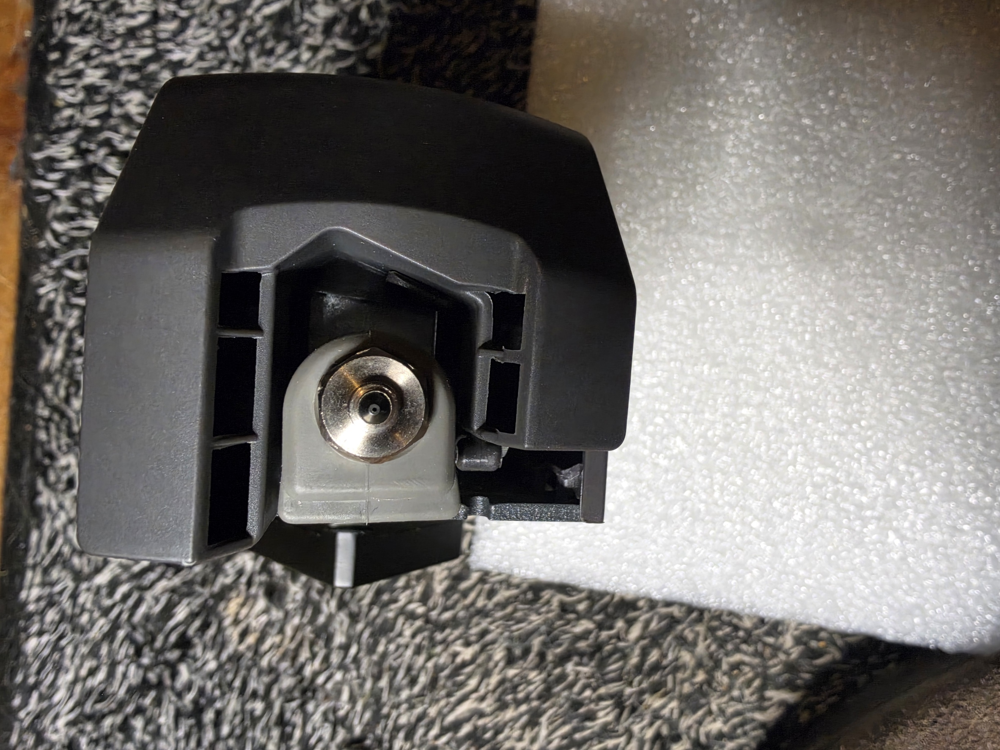

Three of those five openings sit off to the side rather than directly in line with the nozzle itself:

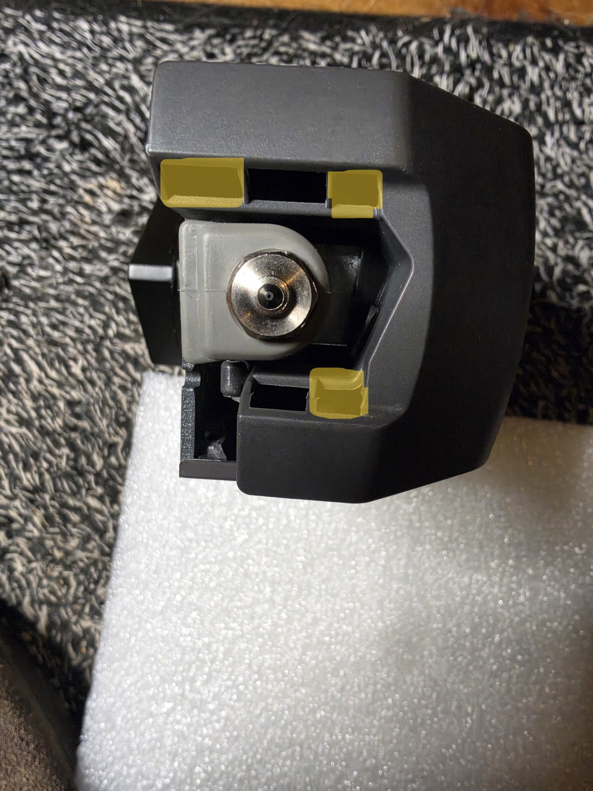

Drawing it out settled why: the white lines trace each opening's actual airflow direction, the red lines mark true vertical alignment with the nozzle tip. Only two openings sit in genuine direct alignment — the other three have to travel in at more of an angle from an off-centre position, with more chance of the airflow dispersing before it actually reaches the print.

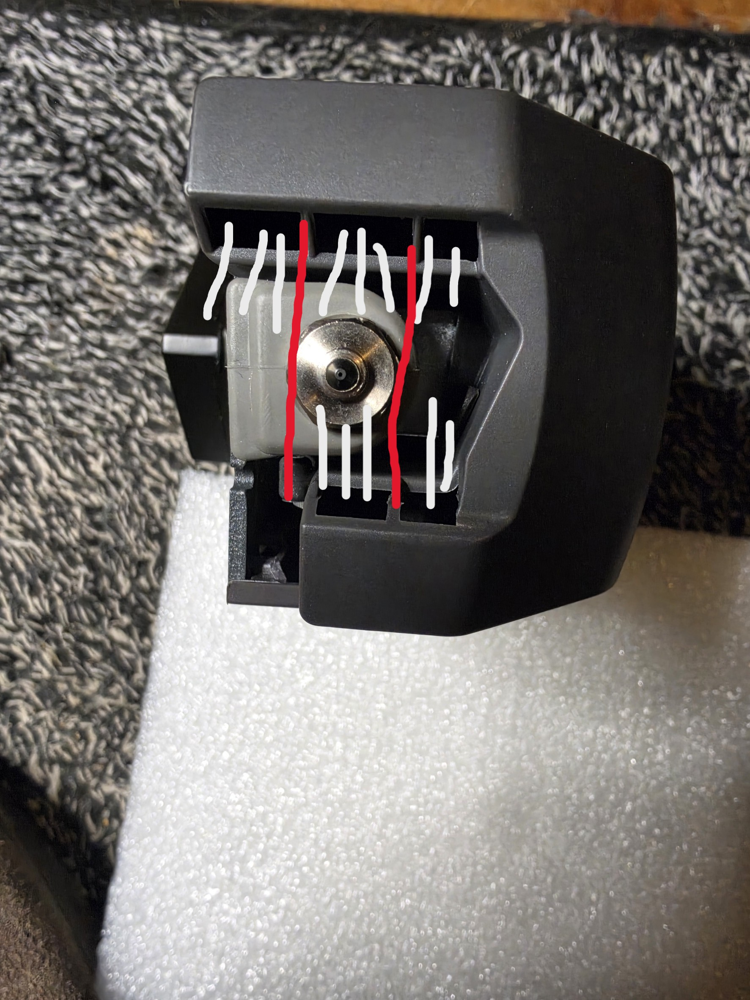

The reasoning: blocking the 3 off-axis openings should concentrate the same total airflow through the 2 directly-aligned ones, for a shorter, straighter path and less dispersed cooling right at the nozzle — the same underlying idea as several known aftermarket duct-narrowing mods for older Kobra printers, just reasoned out directly from this printer's own real geometry rather than copied from someone else's design.

A contoured foam plug (matching the internal duct shape, not just a flat tape patch) went into the single outermost off-axis opening, with the two inner off-axis openings simply taped since air still needs to flow past them toward the aligned ones regardless. Duct split apart cleanly into its two halves for easier access while fitting it. The test plan: a real, controlled before/after using a [multi-feature overhang/bridging torture test](https://www.thingiverse.com/thing:7402799) — a bridging cone, a twisted spiral overhang tower, a curved bridge, and a small stepped section, several failure modes in one print — run once on the unmodified setup, then again on the taped-up spare head with the exact same slicer profile, both captured with Kobra Time Lapse for a real recorded comparison, not just a photo of the end result. **Result further down this same entry: comparable, not a clear win — and an honest case for why this foam-plug version was never really a fair test of the idea in the first place.** If a properly pointed redesign does prove out later, the foam gets replaced with a printed PLA bung — that plenum area sits in the fan's own airflow path, actively cooled, so PLA should hold up fine there despite being near the hotend.

> **The real print settings for this test**, read directly from Slicer Next's own saved profile rather than transcribed from memory: 0.2mm layers, 240°C nozzle, 0.915 flow ratio, 0.05 pressure advance, 18mm³/s max volumetric speed — all matching the confirmed calibration from Day 12 — plus 30% infill/wall overlap (today's Day 12 gap fix, tuned up from 25%), 10% gyroid sparse infill, random seam, 200mm/s walls, 350mm/s travel. One genuine bonus find while pulling these: **the part-cooling fan's own profile has `fan_min_speed` and `fan_max_speed` both set to 100%** — genuinely no modulation range at all, off only for the first layer then flat-out from layer 3 onward. Real confirmation of something already suspected purely by watching the printer with the naked eye earlier the same day.

### A real slicer bug found mid-benchmark, and a second data point on the onboard camera

Before the baseline torture-test print even started, a full read of the actual saved profile (not a remembered impression of it) turned up a genuine miss: `enable_overhang_speed` was set to `"0"` — off — even though Anycubic's own vendor base profile it inherits from sets it to `1` by default, with real tiered slowdowns underneath it (50mm/s at 25% unsupported, 30mm/s at 50%, 15mm/s at 75%+, 30mm/s for true bridges). With it disabled, every overhang and bridge had been printing at the same flat 200mm/s as fully-supported walls, with zero extra time to cool and hold shape before gravity worked against it — a real, verifiable cause behind curled, drooping overhang failures on an earlier attempt at this same test. Re-enabled it (matching Anycubic's own intended default) along with the already-agreed 30% infill/wall overlap, for only ~10 minutes of added print time — cheap, and the first layer that came out of it was the cleanest yet.

Separately, and unrelated to the print itself: both Slicer Next's own camera panel and Kobra LAN Monitor's camera panel dropped the K3M's onboard camera feed simultaneously, mid-print, with nothing sent and nothing changed — just printing. **Second time this has happened**; the first time needed a full power cycle to recover. Likely cause: the printer's own onboard video pipeline appears to support very few concurrent viewers, and having both apps' camera panels open at once was enough to exceed it. [Kobra Time Lapse](https://github.com/A-to-PC/Kobra-Time-Lapse)'s own capture, running throughout on a separate WiFi camera, was completely unaffected — a live, real-world confirmation of why it deliberately uses external camera hardware rather than the printer's own feed: it isn't competing for a slot on a stream that's already demonstrated it can't reliably serve two viewers at once.

Two strikes in two days was enough reason to act on it rather than just note it: [Kobra LAN Monitor](https://github.com/A-to-PC/kobra-lan-monitor) gained the same option the same day — an optional network camera per printer, pointed at the exact same WiFi camera Kobra Time Lapse already uses, with a switcher that only appears once one's actually configured. Getting it actually working took three separate real bugs, not one: a missing `-rtsp_transport tcp` flag (ffmpeg silently defaulting to UDP, a transport the camera doesn't serve reliably — VLC papers over this automatically, a bare ffmpeg call doesn't); a second deadlock from ffmpeg's own stderr never being drained, the exact same class of bug just fixed in Kobra Time Lapse hours earlier that same day; and underneath both of those, a plain data-entry typo — the saved camera IP was `192.16.77.14`, not the real `172.16.77.14`, found by reading the actual saved settings file directly rather than guessing further. Fixed all three, confirmed live: the feed connects almost instantly, defaults back to itself correctly across a restart, and — the real point of building it — now means Slicer Next can have the printer's own onboard camera entirely to itself, no more two apps contending for a connection slot that's already been shown to only reliably serve one.

### A real auto-stop bug in Kobra Time Lapse, found the same day as the leveling fix

Earlier the same day, starting a capture before leveling finished was fixed and confirmed live. Later in the day, a different symptom showed up: a print finished, but the app kept capturing indefinitely, frozen at the same layer number. Reading the actual code found the real cause — `MapState`'s substring matching checked the generic `"print"` keyword *before* any terminal one (`"cancel"`, `"fail"`, `"complet"` etc.), so a raw state string shaped like `"printFailed"` matched `"print"` first and was read as still-printing, never reaching the failure check at all. Reordered the checks so terminal substrings win, and added a second, independent line of defence — a 10-minute stall timeout, in case some other unforeseen state string slips through the same way. Both fixed and built into a new v1.0.4.

Real confirmation came almost by accident: the exact same symptom showed up again later that day, which briefly looked like the fix hadn't worked — until it turned out the *old*, pre-fix v1.0.4 was still the one actually running, never reinstalled over the live capture. Once that was sorted, the distinction held up: normal polling lag resolves in seconds, this bug sat frozen indefinitely with no resolution at all — a real, useful way to tell the two apart if it ever shows up again. Not yet released — staged alongside a second real fix (session folders now named after the actual print job instead of just a timestamp, "not helpful to search as a human") pending a clean confirmed run before tagging it.

### A full motion-settings audit, after the baseline print's real result

The baseline (no-mod) print came out honest, not perfect: the twisted spiral tower, both bridging cones, and the stepped section all held up cleanly, but the curved bridge span sagged into loose, stringy droop rather than holding a clean flat surface — a real, attributable failure on the single hardest feature in the test, not a blanket failure across the board.

More unexpected: several of the curved surfaces — the same bridge wall, the spiral tower — came out with small, randomly-scattered bumps across an otherwise glossy finish. First guess was moisture (trapped water boiling into tiny steam bubbles on the way out of the nozzle), a real and common cause of exactly this look — but the filament in question was freshly opened, sealed stock, not an old exposed spool, which ruled that out. The better-supported read: ringing/resonance, excited by rapid direction changes on curved geometry at whatever acceleration and speed the profile happened to be running.

That led to pulling the actual profile apart against Anycubic's own vendor defaults, line by line, rather than guessing at a fix — and it turned up more than one thing running hotter than Anycubic itself recommends for this exact frame:

| Setting | Anycubic's own default | What the profile had drifted to |
|---|---|---|
| `bridge_acceleration` | 3000 | 5000 (+67%) |
| `inner_wall_acceleration` | 5000 | 6000 (+20%) |
| `default_acceleration` | 5000 | 2000 (lower, not higher — untouched) |
| `outer_wall_speed` | 150mm/s | 200mm/s (+33%) |
| `top_surface_speed` | 100mm/s | 150mm/s (+50%) |
| `smooth_coefficient` | 40 | 80 (2×, corner-rounding aggressiveness) |

None of these were ever a deliberate, reasoned decision on their own — they'd crept upward during the earlier speed-chasing calibration work (Day 12 and after), each bump justified in isolation by "faster is fine, nothing broke," without ever checking whether the printer's own resonance tuning could actually support running that much harder. Generic online advice to "just raise acceleration" carries exactly this trap: it's untethered from whether a specific frame has been tuned to handle it, and the vendor's own numbers exist for a reason.

All of it reset to Anycubic's exact vendor values — not new guesses, the literal numbers from their own base profile. `outer_wall_speed` and `bridge_acceleration` are the two most directly relevant to what actually showed up in the photos: the outer wall is the visible surface carrying the ringing texture, and the bridge is the single feature with zero margin for imprecision. Reslicing and reprinting the identical torture test with the corrected profile — ~5 more minutes added, on top of the ~10 from re-enabling overhang speed.

Also worth checking once there's time away from the printer: physical play in the gantry's wheels/bearings and belt tension, which would compound whatever ringing the settings alone were causing — a hardware-side check, not something any slicer setting can fix on its own.

### The bench, enclosure and filament dryer build starts today too

The finalised design for the combined bench/enclosure/filament-dryer structure — most of the electronics and timber already on hand — gets most of its carpentry done today: **[full write-up in its own reference section](#reference-the-bench-enclosure--filament-dryer-build)**, kept separate from the day-by-day log since it's an ongoing build rather than a single day's event.

### The modded-duct test, and an honest reassessment of what it actually proved

With the corrected settings holding, the taped-up spare head went back on and the identical torture test ran again.

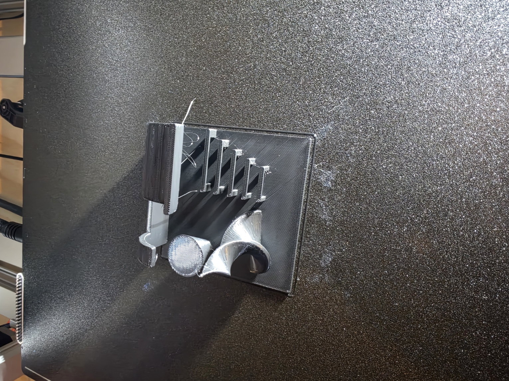
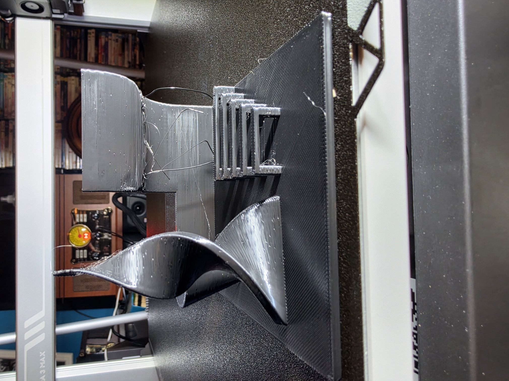

First impression watching it print live was a clear, major win. A careful side-by-side of the actual photos afterward told a more honest story:

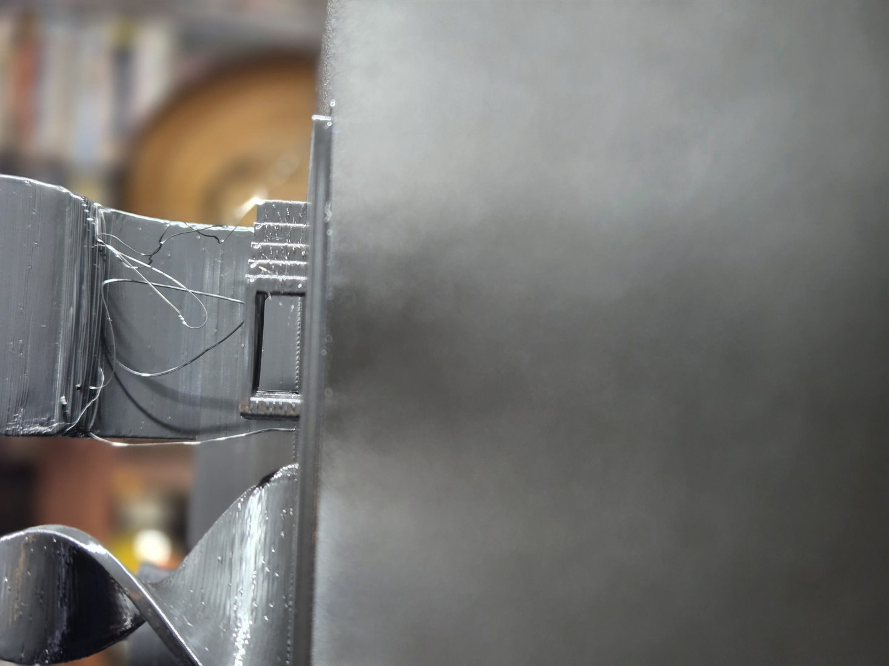
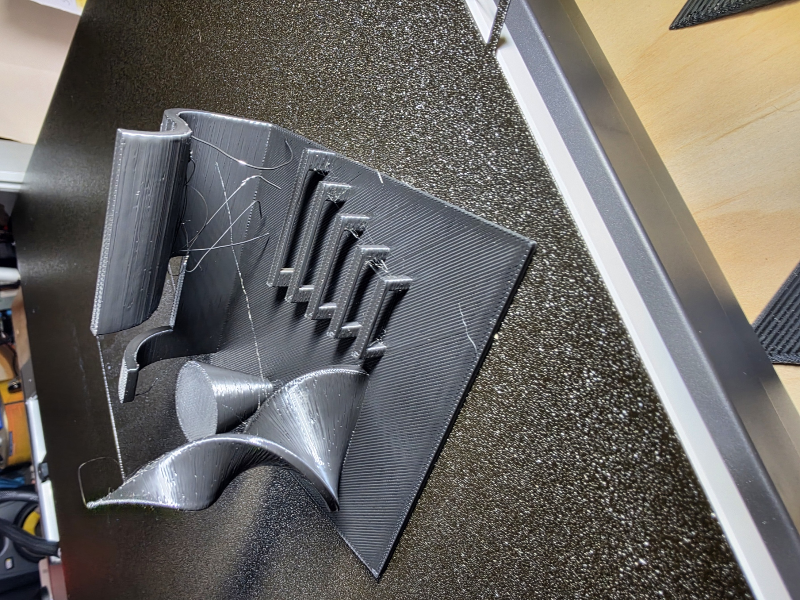

Comparable, not a clear win — the bridge section shows a similar amount of stringing in both. The corrected acceleration/speed settings from earlier the same day were very likely doing the real work, not the duct concentration idea.

**Not happy calling this a fair test of the duct concentration idea, in all honesty** — it still used the stock duct's own broad, square openings, just with 3 of the 5 taped shut. The 2 openings left open were only ever chosen for being in vertical *alignment* with the nozzle, not for actually being well-shaped to direct airflow there — and thinking it through properly, the stock opening's own geometry likely sends more air upward than it does down onto the nozzle tip, alignment or not. Blocking three badly-aimed openings and keeping two others that are *also* not well-aimed was never going to isolate whether concentrated, directed airflow actually helps — it only tested "fewer openings from the same unfocused shape," which is a different, weaker question.

The real test is still ahead: a genuinely pointed, narrowed-tip duct (the 2-tube, ~5mm-reduced-tip design already reasoned out), mocked up on the spare toolhead using the [Covic 3D duct](https://makerworld.com/en/models/1787228-anycubic-kobra-3-max-fan-duct-replacement-model) as a real mounting reference rather than the stock shape at all.

### A side quest into whether Slicer Next itself could get an "Upload only" button

Slicer Next has no way to upload a sliced file to the printer without immediately starting it — a real, everyday annoyance, since it means waiting for one print to finish before you can even queue the next. OrcaSlicer, the project Slicer Next is forked from, has always had this as a plain checkbox. Worth checking properly rather than assuming it's unreachable: Slicer Next's own installed folder carries a genuine, complete **GNU AGPL-3.0** `LICENSE.txt` — real copyleft open source, not boilerplate. A real public repository exists too: `github.com/ANYCUBIC-3D/AnycubicSlicerNext`.

Forked it, and reading the actual C++ source directly (not guessing) found the real picture:

- The "Upload and Print" checkbox genuinely exists in the open code (`PrintHostDialogs.cpp`) — unchecking it sets `post_upload_action` to `None` instead of `StartPrint`. Real, working, already-built functionality.
- But the K3M's own "Remote Print" button routes through a completely different, Anycubic-specific dialog (`SelectMachineDialog`) that doesn't have this checkbox at all — a Bambu-Lab-style device-pairing system, not the generic OrcaSlicer print-host path.
- Traced the actual network call behind that button (`on_send_print` → `PrintJob` → `NetworkAgent::start_local_print_with_record`) and found it's not implemented in the open source at all — it's a function pointer dynamically loaded from a **precompiled, closed DLL** (`MachMQTT.dll` and friends) sitting right next to the open-source GUI executable. The exact same split BambuStudio and OrcaSlicer upstream both use deliberately: open GUI, closed device-communication "network plugin," so the proprietary protocol code never has to be released under AGPL.
- One real, concrete lever found in the open code anyway: a config field, `bbl_use_printhost`, sitting right in the K3M's own machine profile, currently `"0"`. Flipping it to `"1"` reroutes the *same* Print button through the open, generic path instead — the one with the working checkbox.

Getting a real test build compiled was its own honest slog — CMake 4.4.0 too new for the project's hard version gate (fixed with a portable 3.31.6, just for this build), OpenSSL failing to build from source because `nmake` needs the proper Visual Studio Developer environment (a plain shell doesn't have it), then OpenSSL's own Configure script rejecting Git's bundled Perl outright ("doesn't produce Windows like paths") until a genuine native Windows Perl (Strawberry Perl) was installed, then a compiler memory limit hit from building with unlimited parallelism against a large precompiled header, fixed by capping it. Eventually produced a real, working `orca-slicer.exe` — launched, sliced, and successfully connected to the real K3M over the network.

The actual result, tested live: selecting **"Elegoo Link"** as the connection type — a plain, generic OrcaSlicer host type, sitting right there in the dropdown — and testing it against the K3M's real IP came back **"Connection to ElegooLink is working correctly."** Real, live confirmation the K3M's own protocol family is built on exactly that generic connection type, not something exotic — the closed DLL's real job is almost certainly the device-pairing/cloud layer on top, not the wire protocol itself. The Device tab stayed blank when tried this way, which tracks: that tab needs the closed pairing layer specifically, not the plain upload connection.

One more precise, unused lead worth remembering: the installed app (version 2.0.0.3) reports its own build as `develop_859` in its filename — a real commit on the repo's `develop` branch, not the `main` branch this fork actually built from. `main` was missing the K3M profile entirely and showed generic upstream branding; `develop` is very likely far more current and would have been the better starting point.

Real, honest conclusion: yes, genuinely open source — proven by building it, not just claimed — but only down to the GUI and slicing engine. The device-pairing layer stays closed, same as upstream. That's a real, structural answer, not a workaround found. Fork and local build cleaned up (GitHub repo and local files both removed) once the actual question was answered — the practical path to "Upload only" stays exactly where it already was: [Kobra LAN Monitor](https://github.com/A-to-PC/kobra-lan-monitor)'s own upload endpoint, fully open, fully working, already built.

---

## Day 17 — Building a Real Slicer, and What It Took to Get the K3M to Accept a File From It

> **TL;DR** — Day 16's Slicer Next side quest ended on "the practical path to Upload-only is Kobra LAN Monitor's own endpoint." Started today anyway on the more ambitious version: a genuine from-source fork of vanilla OrcaSlicer, renamed painstakingly enough that nothing about it collides with anything actually released, with a real native Upload-and-Print connection to the K3M built from scratch. The rename and the build both came together in one session. Getting the K3M's own firmware to actually *accept* an uploaded file turned into its own investigation — the real cause was one wrong multipart form field name, found only by a second, cleaner packet capture. With that fixed, a real upload finally completed, but the printer then sat on "Downloading files, Please Wait" indefinitely with no resolution before the day's work stopped. In parallel, real progress on the physical bench/dryer/enclosure build too.

### Forking vanilla OrcaSlicer instead of patching Anycubic's stale one

Day 16 found Anycubic's own Slicer Next fork is real, working AGPL-3.0 open source — but their public repo was seven months stale, missing the K3M profile on `main` entirely, and the actual device-pairing logic stays in a closed DLL regardless. Rather than keep fighting a fork that isn't actively maintained in the open, forked `SoftFever/OrcaSlicer` directly at its latest real tag (v2.4.2) instead — a completely different, more current codebase than what Anycubic branched from.

> **A standing rule that mattered here, restated plainly:** the real, working Anycubic Slicer Next install stays completely untouched through all of this — never edited, never even risked. Every experiment happens in this new, separate fork.

### A painstaking rename, done properly

Before writing a single line of new functionality, the whole codebase got renamed to Kobra Slicer — not just the window title, but genuinely deep: the actual shipped `orca-slicer.exe` and `OrcaSlicer.dll` renamed via their real CMake output names (not just cosmetic `.exe` metadata) to `kobra-slicer.exe`/`KobraSlicer.dll`, the exported DLL symbol itself renamed, the Windows registry protocol handler, the Linux D-Bus single-instance identifiers, the OS credential-store service name, a hidden machine-id marker file, and every self-referential string in every dialog the app shows about itself. A dead telemetry path that POSTed system info to Bambu Lab's own servers got disabled outright rather than just renamed. The About dialog kept OrcaSlicer's own copyright notice intact (AGPL requires it) and got a separate line added above it instead of overwriting anything. The one deliberately-skipped category: real upstream GitHub links and documentation URLs in code comments, since erasing genuine provenance isn't the same thing as branding.

### A real, dedicated Anycubic print host — built from captured traffic, not guesswork

The generic "Elegoo Link" print host that looked promising on Day 16 turned out to be a dead end once actually read closely: its real protocol only activates when `printer_model` starts with `"Elegoo Centauri"`, so the earlier "Connection to ElegooLink is working correctly" result was a false positive from a shallow fallback check — a plain HTTP GET that just looks for the string "ELEGOO" anywhere in the response body, not proof of anything real. Anycubic's own shipped K3M profile declares `host_type: "octoprint"`, but that was never actually verified either — and it turns out not to matter, because stock firmware doesn't expose anything a generic printer-host protocol can talk to at all without Rinkhals underneath it, which is not going back on this printer (see below).

The real answer came from watching the real thing happen: a genuine Windows packet capture (Wireshark/tshark, `pktmon` for the actual capture since it needs no separate driver install) taken while Slicer Next itself did a real Upload-and-Print against the real K3M. That captured the actual, complete protocol:

- `GET http://<printer-ip>:18910/info` returns a JSON payload that includes a ready-to-use `fileUploadurl` field, signed token included — no signing scheme to reverse-engineer, the printer just hands out the full URL.
- `POST` that URL as a `multipart/form-data` file upload.
- A real JSON response confirming success and naming the file as stored on the printer.

Built as a genuine, dedicated `AnycubicLink` print host class from that captured spec — not a hack bolted onto Elegoo's code, a real implementation of the real protocol, registered as its own proper host type in the UI.

> **No Rinkhals, on principle, not just for this printer.** Getting a generic print-host connection working at all would be trivial with Rinkhals back on — genuine Klipper/Moonraker underneath handles this kind of thing natively. Explicitly ruled out anyway: these tools exist for the 95% of owners who will never install a community firmware layer and shouldn't have to. Install-and-run stays the bar for every tool in this family, this one included.

### The K3M's firmware speaks two gcode dialects at once, and rejects anything that doesn't match both

Getting the HTTP upload mechanism working was the easy part. The printer's own upload endpoint immediately started rejecting every real file with `{"code":19007,"message":"Invalid gcode file"}` — and chasing that down turned into its own real investigation, with more than one wrong turn along the way worth being honest about.

First real, testable theory: this codebase's own vanilla Klipper output calls a real Klipper macro, `SET_VELOCITY_LIMIT`, on every single acceleration change — thousands of times in a normal print, exactly the same command-flooding pattern that hard-locked this printer twice back on Day 11 when raw OrcaSlicer output was sent to it directly. A real export confirmed it: 7,639 occurrences in one print, versus exactly one in the equivalent Slicer Next export. That one occurrence turned out to be for cornering jerk, not acceleration at all — a real, genuine Klipper command that only fires once because jerk barely changes mid-print, sitting right next to thousands of `M204` (the older, Marlin-style command) doing the actual per-feature acceleration work instead. Anycubic's fork is a genuine hybrid of both gcode dialects, deliberately: real Klipper syntax where it's cheap (once per print), Marlin syntax where the real Klipper way would be too much for their firmware's motion controller to safely absorb. Patched the acceleration-writing code to match exactly — Klipper flavor now uses `M204` for acceleration and keeps the real `SET_VELOCITY_LIMIT` for jerk, mirroring the real, captured behavior line for line.

That fix alone didn't clear the rejection. Wasn't the end of the story, and it took a direct, fair correction to actually treat it as one: rather than keep testing single hypotheses one at a time and rebuilding after each guess, the right call was a genuine, complete side-by-side diff of a real Kobra Slicer export against the real Slicer Next export of the identical model — every structural difference logged in one pass before touching any more code, not chased as they turned up.

That full comparison found real, concrete gaps: the exported file wasn't even the right *format* — a bare `.gcode` text file instead of the `.gcode.3mf` package Slicer Next's real upload actually sends (a real, existing `use_3mf` config option this codebase already supports for other vendors, just never turned on for the K3M). Beyond that: an entirely different producer signature in the file header (`"generated by Kobra Slicer"` vs `"generated by AnycubicSlicerNext"`), and two whole metadata sections — `ams_info` and `statistics` (real filament usage, print time, model size, layer count) — that Slicer Next's real output writes and this codebase's own gcode writer had no code for at all.

> **The producer-string check wasn't a guess — it's sitting in the real firmware binary.** The K3M's own `gkapi` service (the same one behind the `/info`/`/gcode_upload` endpoints, extracted back on Day 11-12) still had its real string table readable. It contains the literal text `"; generated by AnycubicSlicer"` — the exact producer line this codebase's own header writer emits — sitting directly among the real, ordered list of the upload handler's own error strings, `"Invalid gcode file"` among them. Confirmed straight from the firmware itself, not inferred from behaviour. This almost certainly also explains the Day 2-6 Rinkhals/OrcaSlicer "cannot parse the file" mystery from months ago: raw OrcaSlicer's own header says `"generated by OrcaSlicer"`, which would fail the exact same check independent of whatever else was happening with Rinkhals' Moonraker layer at the time.

Implemented all of it as a real, gated code path (only for Anycubic printers, so nothing about how this codebase exports for any other vendor changes): the file format switch, the producer line, matching `CONFIG_BLOCK` delimiter formatting, and genuine `ams_info`/`statistics` blocks built from values this codebase already computes internally for its own UI, not fabricated. One real implementation bug caught along the way by actually re-checking the exported file rather than assuming the fix landed: the statistics block's print-time field came out blank on the first attempt, because the real print-time estimate isn't computed yet at the point in export where that block gets written — fixed by switching to the same inline placeholder-substitution mechanism this codebase already uses elsewhere for exactly that timing problem.

### The real bug wasn't in the gcode at all — it was the wrong form field name

Every content-level fix above was real and correct, and none of them moved the needle. The actual cause was found by taking a second, cleaner packet capture (the first two were quietly duplicating every frame at multiple network-stack layers — `pktmon`'s default behavior — fixed with `--comp nics` to capture only at the physical NIC), aimed specifically at the multipart upload body this time instead of the surrounding JSON. It showed the real Slicer Next upload sends a plain text field named `filename` alongside the file, with the file itself under form field name `gcode` — not `file`, which is what this codebase's own implementation used, copied from another vendor's print host without ever being verified against real traffic. That one wrong field name meant the server's form parser was never finding the file content at all, independent of anything about the gcode inside it — which is exactly why every content-level fix up to that point made no observable difference. Fixed in `AnycubicLink.cpp`, and the identical unverified guess turned up in Kobra LAN Monitor's own upload endpoint too — fixed there in the same pass.

With that fixed, a real upload finally completed: Kobra Slicer's own UI showed "COMPLETED" for the first time, and the printer's touchscreen showed genuine "Downloading files, Please Wait" with a real progress bar. It then sat on that screen indefinitely, never completing or erroring — where the day's software work stopped, unresolved.

### The bench, dryer base, and enclosure — real physical progress alongside the software

While the slicer saga above played out, real construction started on the 4-pallet dryer base and K3M enclosure design finalised a couple of days earlier — the design work meeting the actual build, in Jason's own words as it happened:

Screwed the pallets together, then the top and bottom, then the sides — the bench's core box taking shape first.

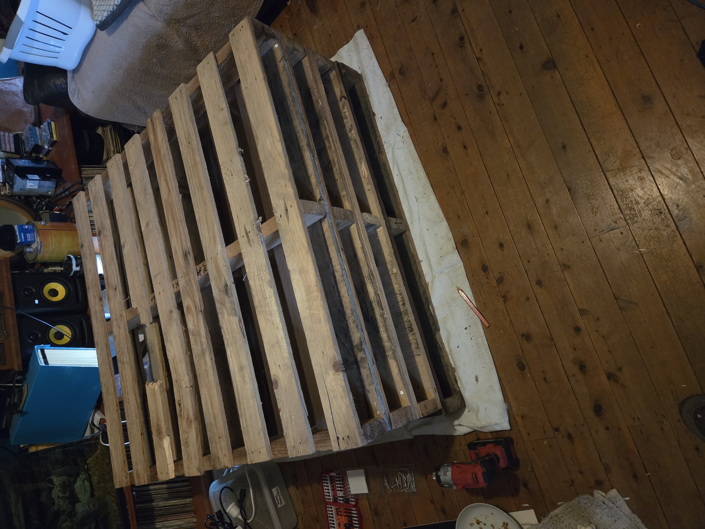

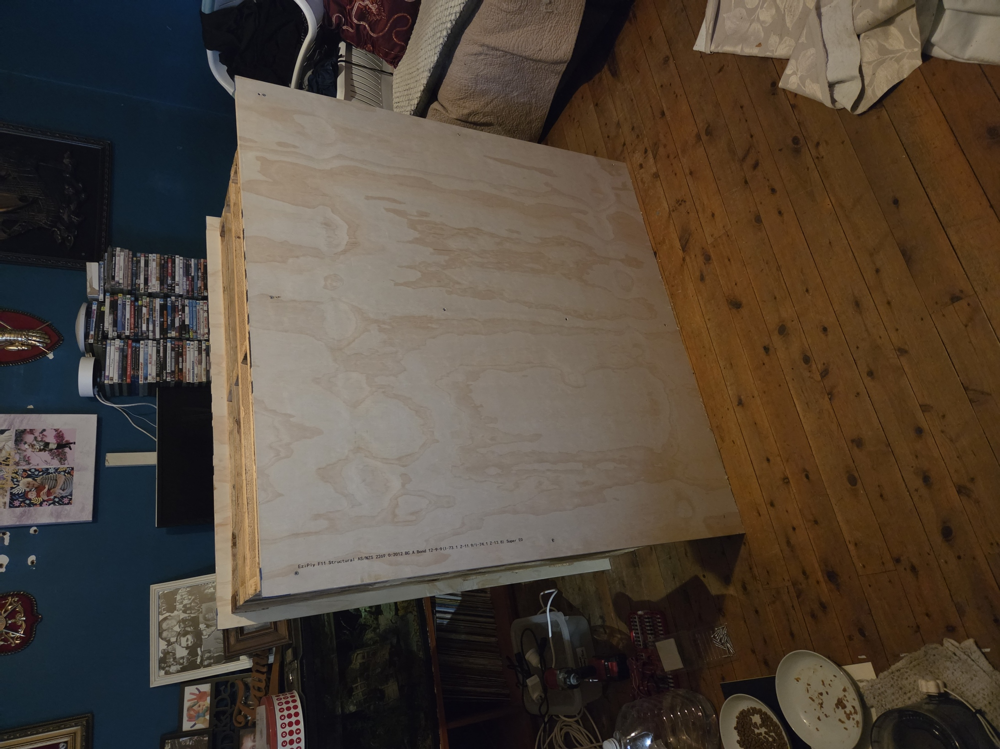

Cut the intake riser into the base of the enclosure and drilled a 75mm hole directly under where the K3M's own fan sits, for real airflow rather than a sealed box.

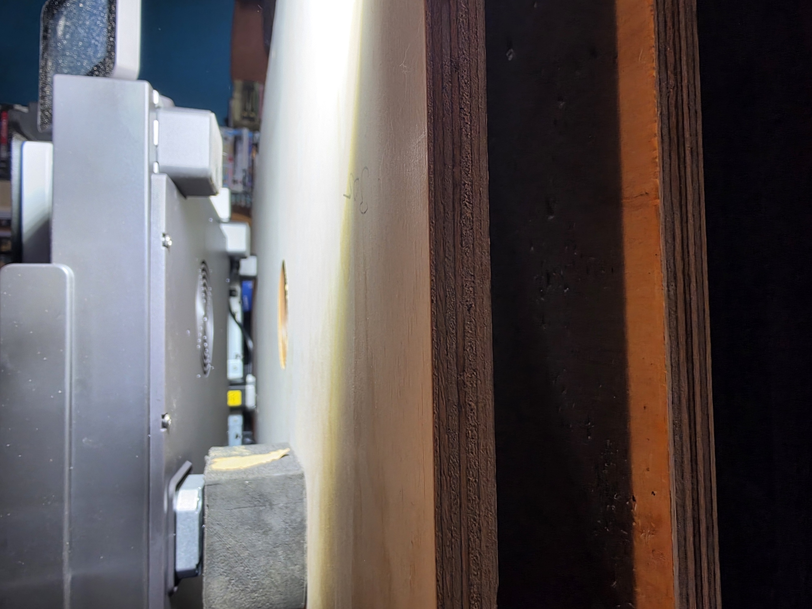

Put the left side panel on and immediately recognised it as the wrong move — building the right side first turned out to be the way to actually get the back and top's shape right, so left it off again and started on the right wall instead, including the "poop catcher" area (the purge/drip catch zone).

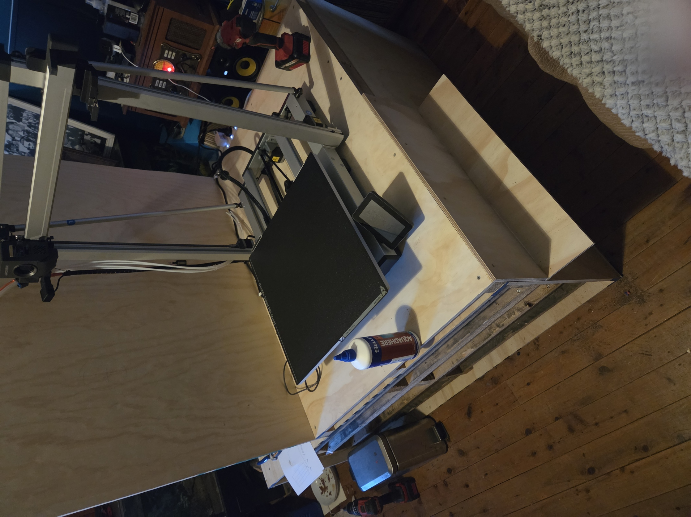

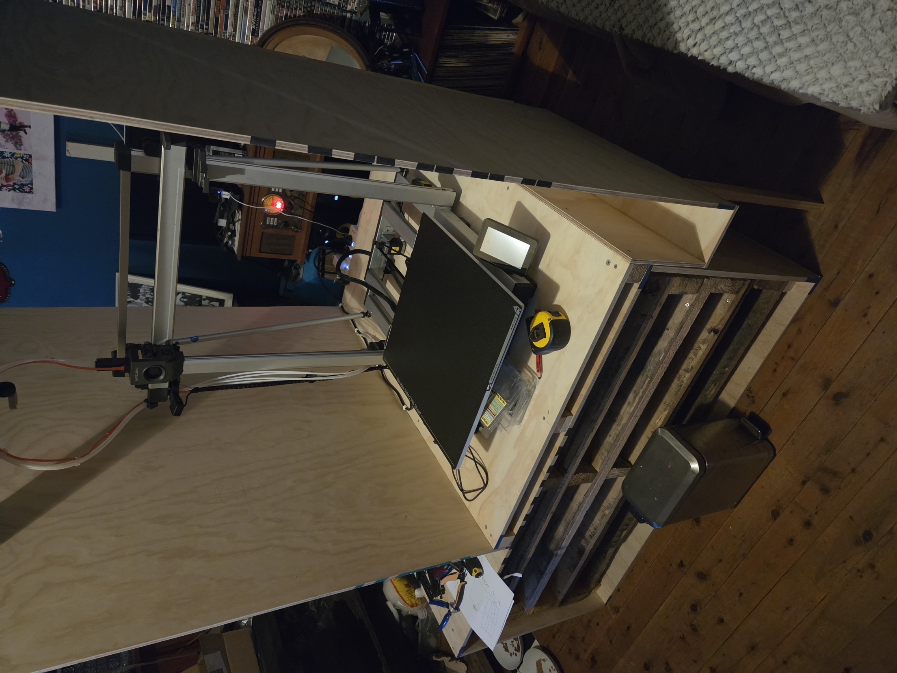

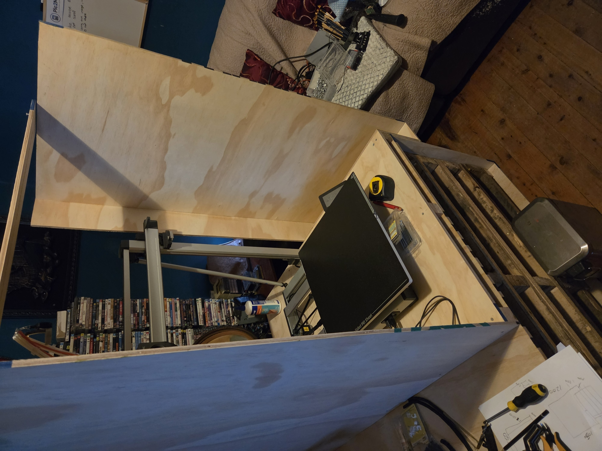

Tools down for the afternoon, and in that time found a real way to anchor the retractable ID-holder cable reels from the Day 3-4 cable management mod into the new structure — repurposed garment hook-and-bar hardware, test-fitted before committing to it.

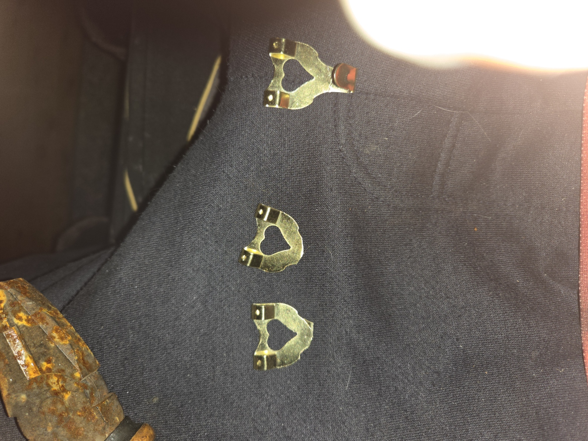

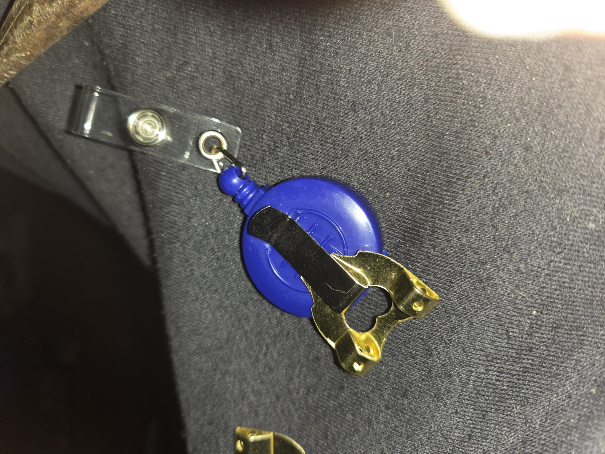

---

## Day 18 — The Upload Was Never Broken, and the Enclosure Closes In

> **TL;DR** — Picked back up after a week's Claude usage limit forced a day off right as Day 17's upload sat stuck on "Downloading files." The real answer turned out to be unrelated to anything actively being debugged: the printer got power-cycled for an unrelated reason, and the model that looked stuck was already sitting on the machine, fully uploaded. Kobra LAN Monitor got the identical upload fix in the same pass. Slicer work is now paused until the printer's free for a real print test — meanwhile the physical bench/enclosure build kept moving fast: back wall, roof, rear access door, both PSUs, and the control panel all went in.

### The upload was never broken

Watching Kobra LAN Monitor's dashboard, exporting fresh logs off the printer, and a longer packet capture on the stalled upload (real MQTT traffic on port 9883 right after the HTTP response, but TLS-encrypted, unreadable) all failed to explain the stuck "Downloading files" screen directly. The actual answer came from an unrelated event: the printer got power-cycled, and the model that had appeared stuck the night before was found already sitting on the machine, not yet printed. The upload had genuinely completed and been valid the whole time — only the visible progress/completion state on-screen was ever stuck, not the file itself.

This is the second time this exact pattern has shown up on this printer, independently: back on Day 2, OrcaSlicer's "Upload and Print" via Rinkhals' Moonraker bridge hit what looked like a broken upload but was actually a broken *print-start* delegate — the file itself always uploaded fine. Two unrelated implementations (Rinkhals' Moonraker layer, and now the K3M's own stock firmware upload endpoint) both show the same shape of fault: **the upload half of "Upload and Print" is solid; whatever is supposed to notice it finished and either report that back or kick off a print is the fragile part.** For a from-scratch print host with no MQTT client of its own, chasing that second signal in C++ is real, open-ended work. Kobra LAN Monitor already has a proven MQTT connection and a proven print-start command sitting in its file browser — so the practical path forward is Kobra LAN Monitor supplying both halves (its own now-fixed upload, and its already-working Print button) rather than building an MQTT client into Kobra Slicer itself just to chase a second signal Kobra LAN Monitor can already send. Kobra LAN Monitor's own upload endpoint turned out to have the identical unverified field-name bug as Kobra Slicer's — fixed in the same pass, rebuilt, and queued for redeployment.

Status: the upload mechanism itself — in both Kobra Slicer and Kobra LAN Monitor — is now believed correct and matching the real captured protocol exactly. Not yet confirmed: an actual print started and completed from either app's upload. The printer's not free to test on right now (mid-build on the enclosure, see below), so slicer work is deliberately paused rather than pushed further blind.

### The enclosure closes in

Real carpentry kept moving fast today: the back wall went on (and turned out to cover the pallet base's back openings entirely — no duct needed for the PSU cooling inlet after all, just a slide-in/out filter cartridge on the front right side instead), support went in for the rear access door to swing off the right rear corner, and the roof went on, glued and screwed.

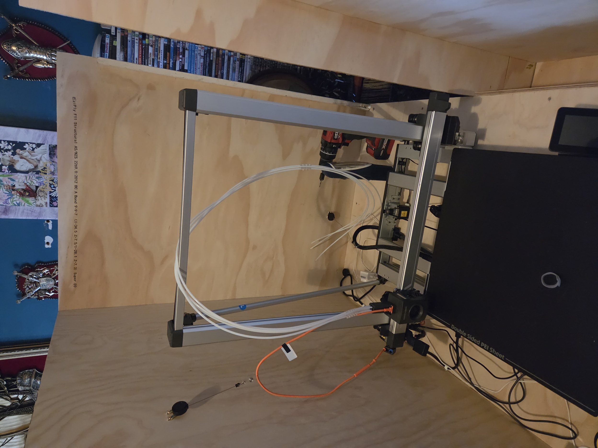

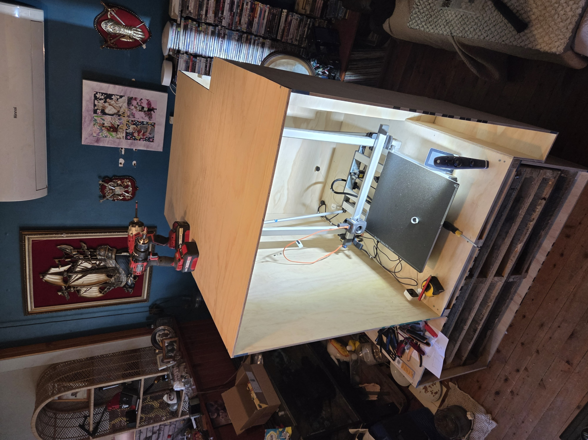

The roof sagged a little once it was on, so a metal angle bracket went in at the rear right corner for real support.

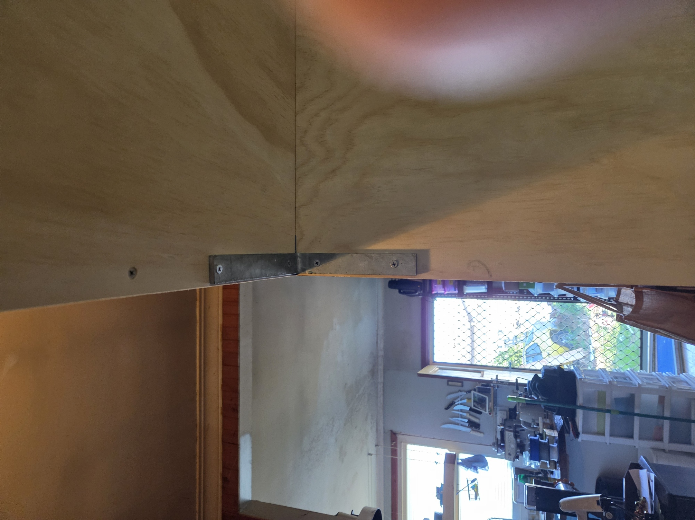

The rear access door got cut and swung on its hinges, a small timber strip went into the top section of the poop catcher's right wall (leaving the bottom open for a clear door later), and support for the ACE Pro to sit on top went in — that section will need a 3mm timber layer once the exterior gets 3mm-plywood-capped over the wiring channels elsewhere in the build.

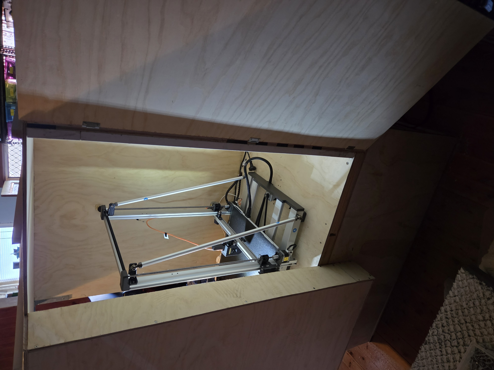

### Power and controls go in

Both power supplies — the 25A unit for the dryer/base zone and the 5A unit for the enclosure zone — got mounted on the back wall, outside the enclosure. The back wall sits with 100mm of open space down to the end of the pallet base below it, and that gap is where the wiring and both PSUs actually live, boxed in with their own dedicated fan running constantly for PSU cooling — separate from the poop catcher's thermostatic exhaust fan, this one has no controller, it just runs.

Two other open design threads got resolved today too. The roof needed real structural support once it showed a little sag (the metal angle bracket above) — built more like a second-storey floor than a simple lid, which turned out to double as a hidden wiring run for the whole enclosure, no separate 3mm re-clad-over-channels layer needed after all. And the plan to relocate the printer's touchscreen outside onto the poop-catcher overhang — which needed a custom ~1000mm ribbon-cable extension that was never actually sourced — got dropped entirely: the screen stays in its original low position, won't see any heat there, and isn't really needed day-to-day anymore now that Kobra LAN Monitor and Kobra Slicer both cover remote status.

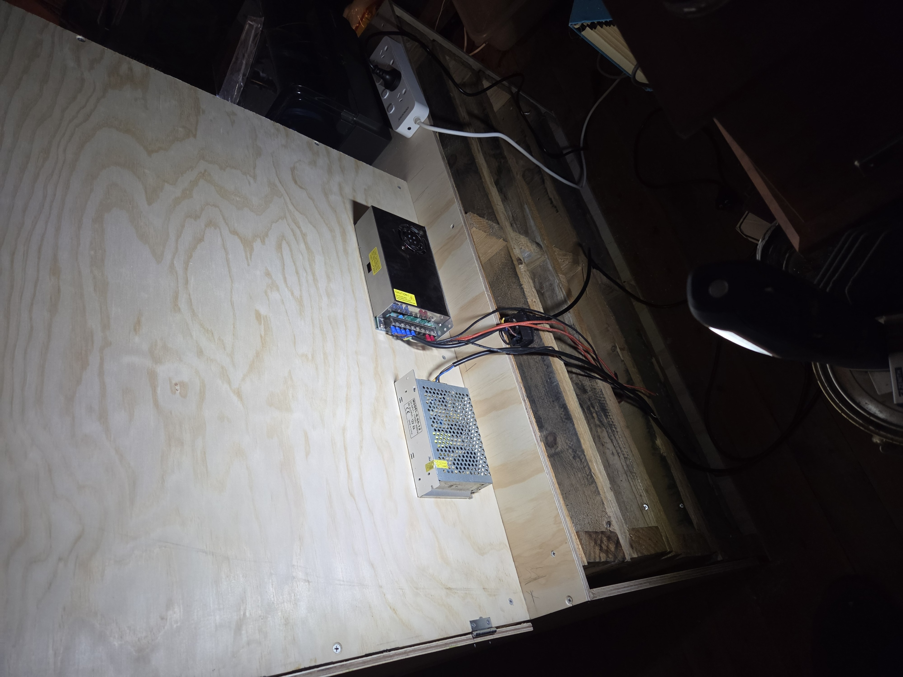

The enclosure's control panel got mapped out on a spare offcut first — temp controller, light switch, dimmer, each position pencilled and measured — then cut, drilled and the actual hardware installed into the real panel. Not wired yet. A lucky find along the way: the temp controller's own probe reaches the cutter wedge with its wire run free, no extension cable needed for now — good enough for the print-run tests planned next. An extension would be needed either way it ends up permanent: routed in from below or above instead of running free, or hidden away neatly through the build's wiring channels rather than left visible.

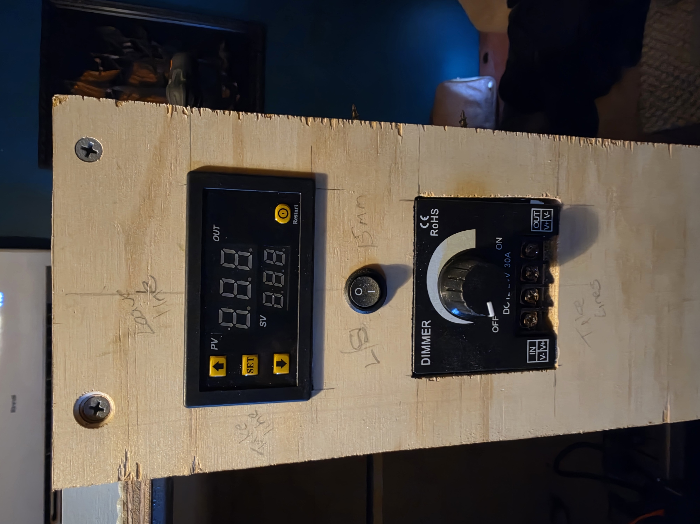

### Working out the ACE Pro tube pass-through

With the roof on, the last open design question was how the ACE Pro's 4 filament tubes get from its position on top of the enclosure down to the toolhead without binding as the toolhead moves, or kinking on tall prints where there's little vertical clearance left to the roof.

A linear ball bearing was the first idea and got ruled out quickly — it needs a hard, precisely round shaft to ride on, and a bundle of 4 soft PTFE tubes is neither, risking abrading the tubes rather than guiding them. A felt or brush-lined guide sleeve was the next idea and is genuinely viable, but landed on something simpler: a single length of soft, low-durometer (Shore A 20-30, not standard 40-60 hose) silicone tube, 20-22mm ID over the ~10mm tube bundle, run 100mm down into the enclosure and ~50mm up into the ACE Pro side. Silicone's own softness does the same job a felt liner would — smooth, low-friction, and it bends gradually along its length instead of the bowden tubes kinking against a hard edge — with one less part. Mounted via an interference fit at the roof (hole drilled slightly undersized versus the tube's OD) rather than glued, so it stays serviceable.

Routing the tubes back through the enclosure and out a sealed exit in the back wall instead was considered and rejected — it would need roughly 2m of extra bowden length to reach around from the roof-mounted ACE Pro, a permanent friction and retraction-reliability cost on every single print, to solve what's likely a fairly minor heat leak. The open bore through the silicone tube isn't fully sealed, but between the roof-line interference fit, the ~40% of the bore already filled by the tube bundle, and 100mm of length with no straight line for air to convect through, the real loss should be modest — and the exhaust fan, which has no backdraft shutter, is already a bigger, unrestricted leak path when idle. Not worth chasing further without first actually measuring it once built.

---

## Day 19 — Sealing Up and Wiring In

> **TL;DR** — With the box itself closed in as of Day 18, today was about making it airtight and getting the wiring in place for power, not turning anything on yet: supports went in around every door opening — sealing surfaces for the doors and, just as importantly, squaring up and bracing a front that had been wobbly — the whole interior got sealed and every screw head covered except the 4 still holding the enclosure down to the dryer base, the extraction fan went into its roof-cavity mount, and both main 12V supply runs got drilled through and routed down to the two PSUs — nothing connected or live yet.

Supports went in around all the door openings — doing two jobs at once: giving each door something to seal against once the clear panels go on, and squaring up and bracing the front, which had been wobbly until these went in.

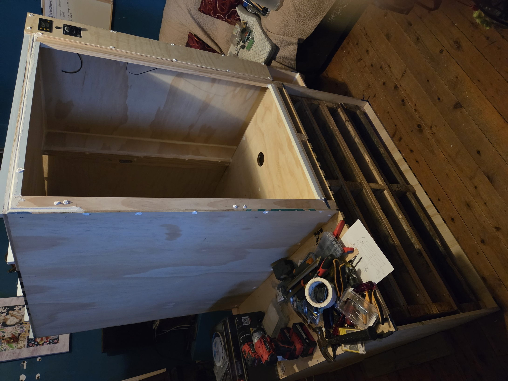

The whole interior got sealed, and every screw head covered except the 4 holding the enclosure down to the dryer base underneath — those stay exposed.

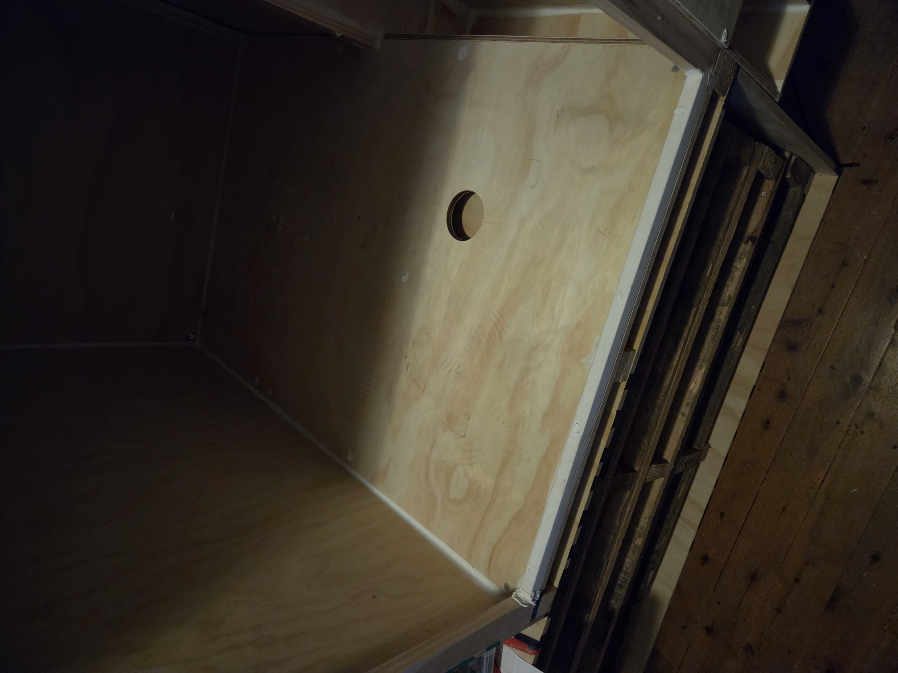

The control panel from Day 18 — temp controller and dimmer — sits mounted on the enclosure's own side wall, still unwired at this point but now permanently in place rather than sitting loose on an offcut.

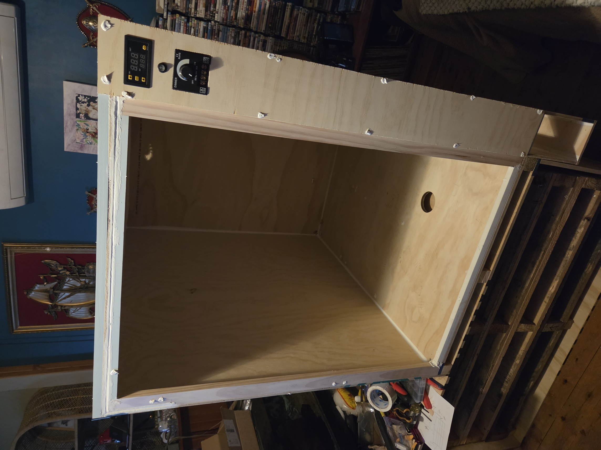

The 75mm hole for the extraction fan got drilled through the roof, and the fan itself mounted into the roof cavity, with leftover support timber glued in around it to close the mount up properly.

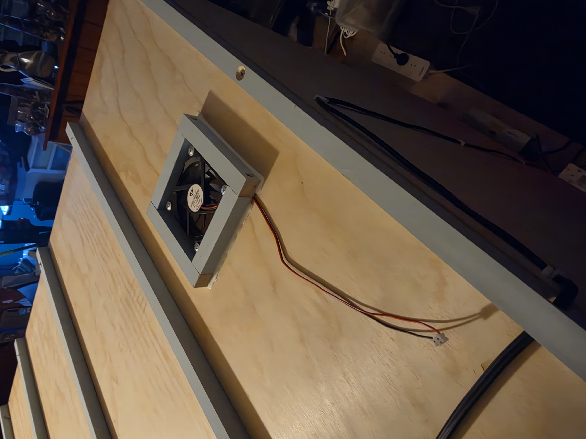

All the holes needed to route the main power wiring got drilled, and both main 12V supply wires got run down through them from the roof into the enclosure body.

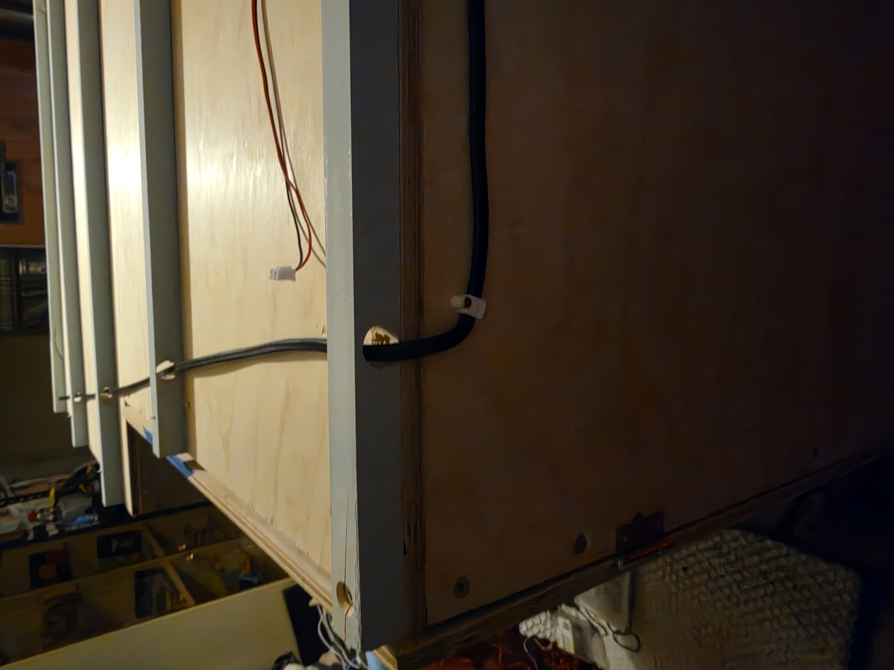

Those runs reach the two PSUs mounted on the back wall from Day 18 — Enclosure PSU and Dryer PSU — cable pulled down to each, not connected up yet.

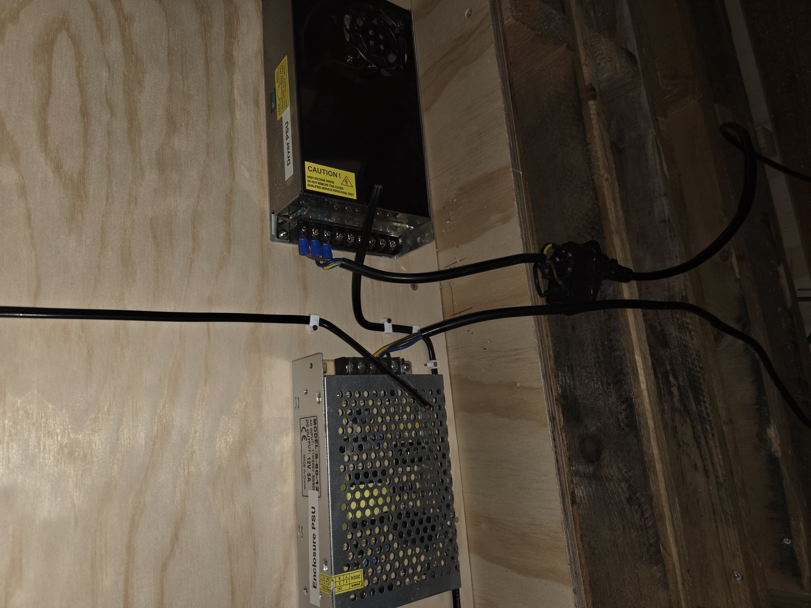

The same wiring pass reaches into the control panel corner too, ready for the temp controller and switches to actually get connected next.

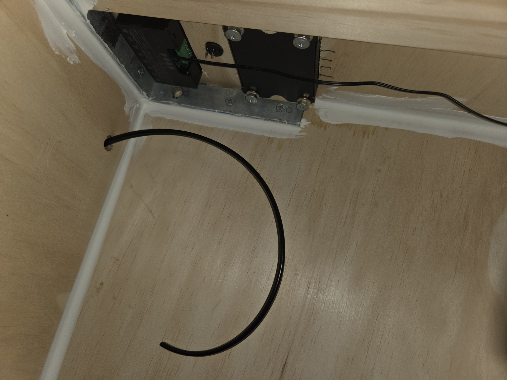

---

## Day 20 — Live Wiring, Paint, and a $2 Diffuser Fix

> **TL;DR** — A lighter day, paint drying taking up a lot of it: the enclosure's wiring got finished (bar the LED light itself, deliberately left unsoldered until painting was done), the temp controller and exhaust fan tested live and working for real, a mains power switch went in, and the interior got two coats of matte black — specifically for cleaner time-lapse footage, not just looks. Also worked out that a $2 clear vinyl shower curtain liner makes a genuinely good LED diffuser, with the layer count tuned per LED colour.

The enclosure's wiring got finished — temp controller and exhaust fan both live, tested for real rather than just checked for continuity. The LED light itself was deliberately left unsoldered until after painting, so a bare wire wasn't in the way. The wiring run still needs to be properly enclosed, with its own access door, rather than left exposed long-term.

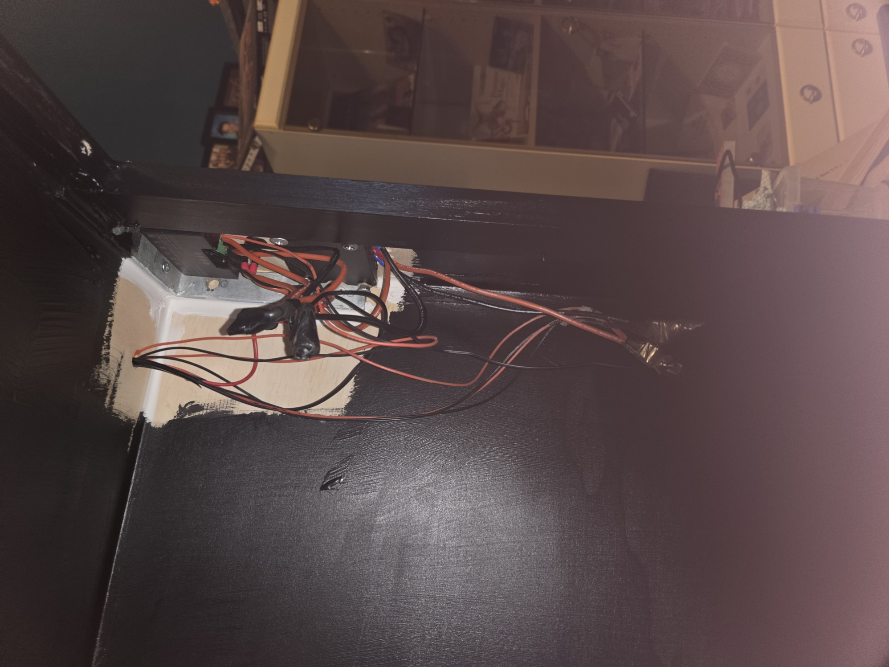

A mains power switch went in on the side, and the temp controller came up live for the first time — reading real numbers off the actual sensor rather than sitting dark on the bench.

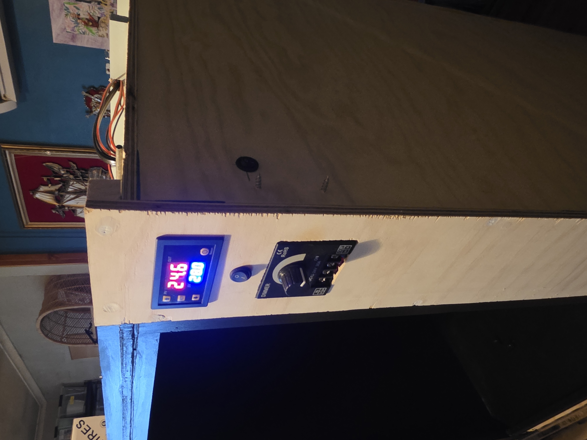

The interior got two coats of matte black paint — not just for looks, but specifically because a flat black interior reads far better on time-lapse footage than bare plywood, avoiding blown-out highlights and colour cast from the timber under the enclosure's own lighting.

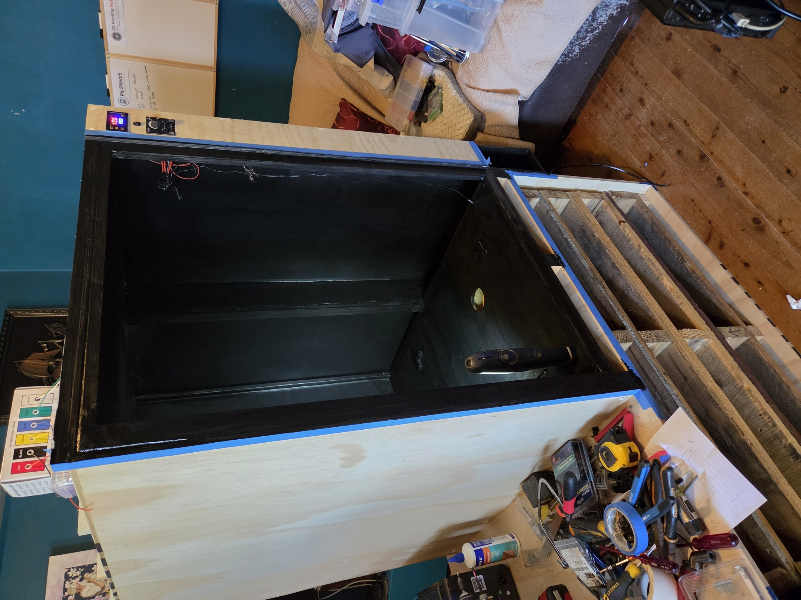

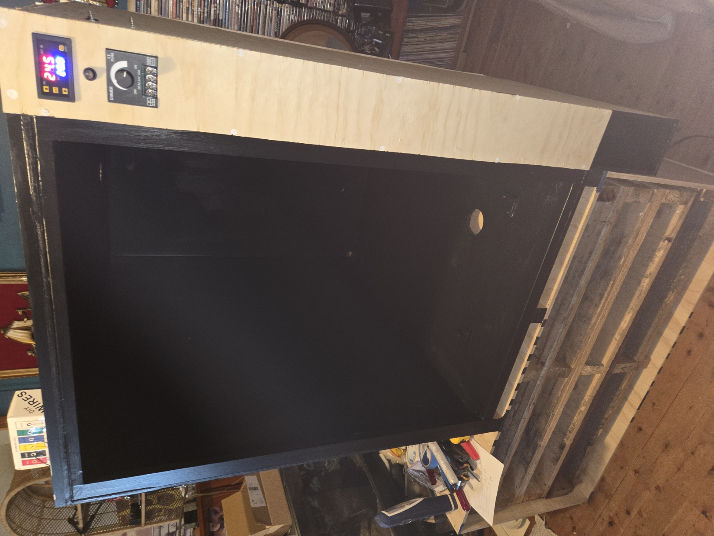

Separate side project: sourcing something to dial back the glare off the temp controller's own LED display — a $2 clear vinyl shower curtain liner (Splash Collection brand) turned out to work well as a diffuser once actually tested, reading noticeably more white/frosted than genuinely clear once lit from behind. Layer count matters and is colour-dependent: 3 layers is the sweet spot for red and blue LEDs, 2 layers for white — and it has to sit as close to the actual screen as possible to work properly, not floating at a distance.

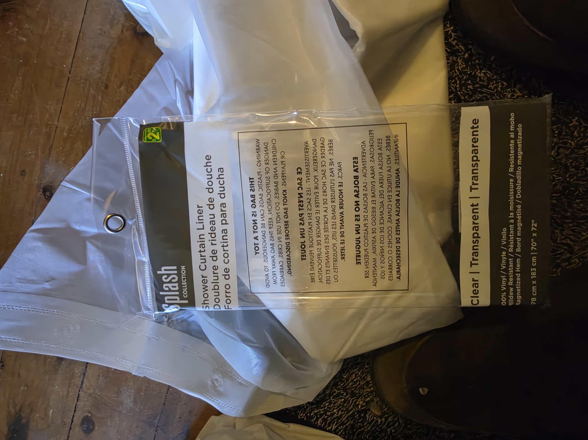

---

## Reference: My Confirmed Calibration

> Every value below is confirmed against a real, physical print on this one printer, with this one filament — not a slicer default, not a guess, but also not a universal number for every Kobra 3 Max. Different filament, a different unit off the line, or a different environment will all shift these. Treat the table as a worked example of the process and a realistic starting point, not a number to copy in blind — run the same sweeps on your own machine and filament before trusting a print to them. Confirmed [Day 12](#day-12--clean-prints-for-real).

| Parameter | Value | Notes |
|---|---|---|
| Nozzle temperature | **240°C** | Real 210–240°C sweep, 5° steps — confirmed live, block transitions landed exactly on the predicted layer. |
| Flow ratio | **0.915** | From a real flow tower — no visible over/under-extrusion, consistent wall thickness. |
| Pressure advance | **0.05** | PA Line method, direct-drive extruder. Governs corner timing only, not adhesion. |
| Retraction distance | **0.2mm** | Real 0.1–2.0mm sweep — stringing only below 0.2mm, genuinely low because this is direct-drive. |
| Max volumetric flow | **>15.7mm³/s** | Real continuous-ramp test (~29–112mm/s) — perfect quality throughout, ceiling never actually found. |
| Speed modes | **All 3 OK** | Silent / Standard / Sport all confirmed live — stock cornering values hold at every speed. |
| First layer height | **0.20mm** | Kept fixed regardless of body layer height — see Day 12's trap. |

---

## Reference: The Bench, Enclosure & Filament Dryer Build

> **Status: the design, not the finished thing.** Most of the electronics and the timber are already on hand, and the bulk of the bench and enclosure carpentry started on [Day 16](#day-16--tearing-down-a-spare-toolhead-for-real-fan-answers) and is genuinely underway as of [Day 17](#day-17--building-a-real-slicer-and-what-it-took-to-get-the-k3m-to-accept-a-file-from-it) — pallets, top, bottom and sides screwed together, the base's intake riser and fan hole cut, framing started on the right wall. What follows is the real, finalised design being built against, documented directly from memory rather than from in-progress photos. Still not the finished thing — a full "as-built" update (with photos) will follow once the structure is actually complete.

The whole thing is one combined structure: a filament storage/dryer base built from 4 pallets, with a fully enclosed housing for the printer itself sitting on top.

### The base — filament storage and dryer

Four pallets, screwed together, enclosed on 7 sides with 12mm plywood. The 8 fork openings across the 4 pallets become 8 drawers, each holding 10 filament spools — 80 spools of storage capacity in total. The remaining left side of the pallets is fitted out as general-purpose cupboards, separate from the filament drawers.

Climate control for the drawers: an STC-3028 humidity controller (mounted bottom right, above the dehumidifier's own clear door) drives a 12V 200W heat pad plus a 12V constant-running fan for circulation. A custom-built dehumidifier sits in the bottom front section, under the poop-catcher part of the printer enclosure directly above it.

Power is deliberately split across two supplies rather than one oversized brick: **25A for the dryer/base zone** (the heat pad is the dominant load here, ~16.7A at full draw, only ever hit briefly during the initial warm-up ramp — once the sealed box is up to temperature it cycles at a much lower average), and a separate **5A for the enclosure zone** (LED strip plus exhaust fan, comfortably under 3A even with everything running). Matching supply capacity to what each zone actually draws, rather than one large supply feeding both.

### The enclosure — housing for the K3M itself

A complete enclosure around the printer, with the purge/poop catcher built into the right-hand side. A full-size clear door across the front gives full access to the printer; a smaller clear door on the right, overlapping the bench by 100mm wider and running full height, gives dedicated access to the poop catcher.

Inside the poop catcher, a cloth baffle stops purge strings rebounding back onto the bed, and an angled floor feeds everything that lands toward the front for easy clean-out. The back half of the right side, behind the poop catcher, opens separately for maintenance access.

The top front of the poop catcher houses the W3230 temperature controller, driving an active 12V exhaust fan set to trigger at 28°C. Lighting is a dimmable, switched 4000K COB LED strip. An arm-mounted 1080p EZVIZ camera handles timelapse duty — the real camera behind [Kobra Time Lapse](https://github.com/A-to-PC/Kobra-Time-Lapse)'s footage. A filtered inlet routes fresh air specifically under the printer for PSU cooling while it's running.

### ACE Pro and the roller-bearing tube pass-through

The ACE Pro sits on top of the whole enclosure rather than beside it, with its filament tubes running down in through the top. They pass through a roller bearing at the entry point, so the tubes can move smoothly with the toolhead's own Z travel instead of dragging or kinking against a fixed opening.

### The touchscreen moves outside the enclosure

Top-right, on the same 100mm poop-catcher overhang rather than a new bracket — reuses structure that has to be there anyway, is inherently protected from ever taking a hit against a wall (the overhang itself blocks that), and means checking status doesn't require opening the door. Reaching it needs the same custom ~1000mm ribbon-cable extension already planned (the screen's real 30-pin IDE-style connector, no commercial cable exists at that length) — connector itself still being worked out: a hot-glue cast of the frame's real flush-mount socket, released with a cooking-spray mould-release agent, gives a physical copy of the exact geometry without ever needing to source or identify the connector, mounted into the timber with screws once made.

---

## Reference: The Tools This Left Behind

Nothing here started as a plan to "build tools" — each one exists because a specific, real gap kept getting in the way.

### [Kobra LAN Monitor](https://github.com/A-to-PC/kobra-lan-monitor) — Released

Self-hosted web dashboard via the reverse-engineered local LAN/MQTT protocol. Live status, continuous camera stream (with an optional separate network camera per printer, since v1.0.5), full file management, ACE filament/drying control, live controls, an Advanced tab for occasional-use extras, cloud-free firmware-update checking, an Auto/Light/Dark theme, and support for more than one printer (add, rename, and switch between them, one actively monitored at a time) — all confirmed against real hardware, no cloud account anywhere.

### [Kobra Time Lapse](https://github.com/A-to-PC/Kobra-Time-Lapse) — Released (pre-release)

Watches the same LAN protocol for print state on completely stock firmware — no Rinkhals, no Moonraker — and grabs frames from any RTSP camera automatically while a print runs, assembling the finished timelapse the moment it's done, with capture timing anchored to real layer changes rather than a free-running clock. Includes an optional, log-only frame-comparison failure check with an opt-in per-print auto-calibration for the threshold. Real v1.0.3 release live on GitHub — tagged pre-release since a couple of pieces (auto-calibration, camera rotation) haven't had a real test yet, not because the core capture/assembly path is unproven.

### [3D Time Lapse](https://github.com/A-to-PC/3D-Time-Lapse) — Stable, not actively updated

The same idea, for the other side of the fork: printers running Rinkhals with Moonraker. Polls Moonraker's own REST API for print state instead of the LAN protocol, so it works anywhere Moonraker already runs — never touches Klipper's config, so a fragile firmware setup can't be made worse by it. Left as-is since moving to stock firmware on Day 6 — it works, just isn't where new development is happening right now. That's a "not right now," not a "never": if Rinkhals goes back on, this is the one that reopens.

### Kobra Calibration Generator — Retired

Generated calibration test G-code directly as parametric geometry, bypassing Slicer Next's format entirely. Built out of frustration mid-investigation on Day 11, back when Slicer Next's calibration wizards still looked broken. Once the real fix turned up — don't repair the mesh, just set the range and slice — this tool's whole reason to exist went with it, so it was retired on Day 14 rather than kept around as dead weight. (Was never published as its own repo.)

*Kobra Time Lapse and 3D Time Lapse look almost identical on the surface, but they're genuinely separate tools for two different setups, not two versions of one app — pick whichever matches your firmware.*

### A tripwire, not a trained eye

The failure-detection feature in Kobra Time Lapse deserves an honest caveat, because it's easy to oversell: it compares each new frame against the last one using structural similarity — brightness, contrast, and pattern correlation across small patches of the image — and flags anything that changes by more than a set threshold. That's it. There's no trained model, no understanding of what a 3D print or a print failure actually looks like, unlike a purpose-built service like Obico, which has years of labeled real-failure training behind it.

A real print failure (spaghetti, a knocked-over part, a piece detaching) does cause exactly the kind of sudden large visual change this catches. So does an enclosure light changing, a roller door opening, or the ACE arm swinging into frame. The algorithm can't tell those apart — it's a blunt, generic tripwire, deliberately kept log-only (not automatically pausing anything) until it's been run against enough real prints on the specific enclosure/lighting/camera setup to know what its actual false-positive rate looks like. That tradeoff is exactly what let it get built as an evening's addition instead of requiring a trained model.

> **Why not just use Obico?** Obico's real integration path (`moonraker-obico`) hard-blocks on a genuine Klipper/Moonraker connection from its very first step, and drives everything through Klipper's specific internal object model. On stock firmware, with no Moonraker to poll, that's not a light integration to add — it's either running Rinkhals again just for this one feature, or building a full server that impersonates enough of Moonraker's real API to fool Obico's client, which stays fragile against every future Obico update. Building a smaller, honestly-scoped detector directly was the better trade for this setup.

---

## Quick Reference: Every Practical Tip in One Place

If you only read one section, read this one.

- [x] **Never repair a calibration model after setting up its height ranges.** Just set the range and slice. Ignore the non-manifold error count on import — it doesn't block a correct print.
- [x] **After any profile edit — including just a layer-height change — recheck everything.** Temperature, pressure advance, flow ratio, retraction, and First Layer Height can all silently revert with zero warning.
- [x] **A too-thin first layer looks exactly like over-extrusion.** Confirm First Layer Height (should stay ~0.2mm) before chasing flow rate after any layer-height edit.
- [x] **Never send an OrcaSlicer-generated file (raw gcode or .3mf) to this printer untranslated.** Its Klipper output floods a command the firmware can't handle at that volume — two real lockups confirmed this.
- [x] **Blobby text/detail on small multi-loop objects → check wall order before retraction.** "Inner/Outer/Inner" adds an extra transition to every loop. Standard "Inner/Outer" fixed it outright.
- [x] **Set a real max volumetric speed after calibration, don't leave the test's raised ceiling in place.** A value like 200mm³/s effectively disables the slicer's own flow-rate safety net.
- [x] **A generic USB webcam works fine on stock firmware.** No official camera module required. Lower resolution (720p) streams more reliably than 1080p on the printer's own video pipeline.
- [x] **The printer's own onboard camera feed can't reliably serve more than one viewer at once.** Confirmed twice — two apps with a camera panel open simultaneously (no other action taken) dropped the feed for both, once needing a full power cycle to recover. A capture tool that matters (like a timelapse) is safer on its own separate camera, not sharing the printer's own feed.
- [x] **Thin, small-footprint parts need real bed prep, not just calibration.** Wipe, then isopropyl alcohol, then fresh glue stick, every print — solved an adhesion failure no slicer setting could. Real testing across many prints since has isolated exactly which step matters: skipping the wipe or the alcohol at different times never caused a failure, skipping the glue stick always did. Glue stick is the load-bearing step; the wipe and alcohol are good practice for a clean surface but aren't what's actually holding the print down.
- [x] **A "success" message from an app or slicer means nothing for real hardware.** Only the printer's own screen, sound, or visible behaviour counts as confirmation — this bit multiple times during upload-path debugging.
- [x] **If ACE Pro auto-backup keeps swapping colours mid-print, check the printer's own backup setting.** Left on its default, it substitutes by material type only, not colour — tightening or disabling it in the printer's own settings, not a firmware bug, is what fixed it here.
- [x] **On LAN mode, don't expect Anycubic's own "check for updates" to work at all.** It only functions over the cloud connection LAN mode deliberately disables. Compare your printer's reported version against a public firmware list yourself instead of waiting on it.
- [x] **Use a purpose-built filament-RFID app to program ACE Pro tags, not a generic NFC read/write app.** The ACE Pro reads structured data, not plain text — and a generic app can permanently lock a tag (a real hardware one-way lock bit) before you even realise the write was wrong.

---

*Anycubic Kobra 3 Max · stock firmware · living reference — update as new findings turn up.*

## License

MIT — see [LICENSE](LICENSE).
